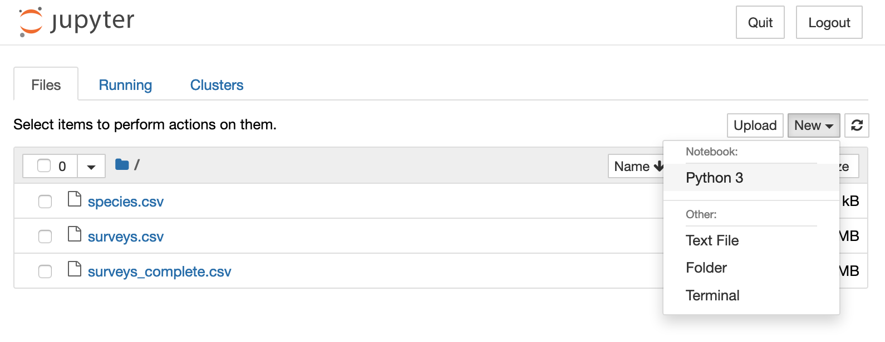

# Python Basics

The official [introduction](https://docs.python.org/3.6/tutorial/) to Python states:

>Python is an easy to learn, powerful programming language. It has efficient high-level data structures and a simple but effective approach to object-oriented programming. Python’s elegant syntax and dynamic typing, together with its interpreted nature, make it an ideal language for scripting and rapid application development in many areas on most platforms.

The simplicity of Python really comes from its very clean (i.e., uncluttered) syntax. This makes programming in Python similar to writing [pseudocode](https://en.wikipedia.org/wiki/Pseudocode), which is writing an algorithm in a readable way.

For example, let's say we want to use a `for` loop to count the number of `G`s in a DNA sequence. In pseudocode, we would write:

```
seq = "...ACGT..."
count = 0
for base in seq
    if base is 'G'
        increment count
print count
```

The simple syntax of Python requires very few changes to make it work.

~~~
seq = 'GACTTAATGGGCAATAGGCAAGCACTTGAAAAAGATGCCAACGACATGAAAACACAAGACAA'
count = 0
for base in seq:
    if base is 'G':
        count += 1

print(count)
~~~
{: .python}

~~~
13
~~~
{: .output}

What are the main differences between the pseudocode and the Python code?

## Python Syntax

To program in Python you must follow the rules of its syntax. Additionally, it is helpful to think carefully about variable and function names as well as providing clear comments. All of these things will result in nice, human-readable code.

### Code Layout

You will notice that Python does not use curly braces `{}` to encapsulate the contents of a loop. Instead, loops are started with a colon `:` and all of the lines within the loop are indented. Here's an example:

~~~
s = "hello"
capital_s = ""
for char in s:
   capital_letter = char.upper()
   capital_s += capital_letter

print(capital_s)
~~~
{: .python}

~~~
HELLO
~~~
{: .output}

The code above creates a `for` loop where the loop iterates over the letters in `s`, and changes them from lowercase to uppercase using the string method `.upper()`.
The capitalized letter is assigned to a variable called `capital_letter`. Then `capital_letter` is appended to the string `capital_s`.
When the loop ends, we print `capital_s`.

Look carefully at the placement of the colon `:` and the indentation and notice how these elements define the loop.

**Tabs or spaces?** Spaces are the preferred way to format indentation. The standard is to use 4 spaces. Tabs will work, but _you absolutely cannot mix tabs and spaces_.

### Indexing

In Python, as well as many other programming languages, the index of the first item in a list, vector, string, etc. is always `0`. This makes it challenging to switch between R and Python, and if you're working with both languages, it is a good place to look for issues.

Using the string `s` from above:

~~~
print(s[0])
~~~
{: .python}

~~~
h
~~~
{: .output}

This means that the last element in an array has the index `n-1`, where `n` is the length of the array.

~~~
n = len(s)
print(s[n])
~~~
{: .python}

~~~
Traceback (most recent call last):
  File "<stdin>", line 1, in <module>
IndexError: string index out of range
~~~
{: .output}

If we try to access index 5 of our string, we get an error. The error indicates that we accessed an element outside of the range of our variable. Instead we need to access index 4:

~~~
print(s[n - 1])
~~~
{: .python}

~~~
o
~~~
{: .output}


# Python vs. R

> ## Count the Gs using R
>
> Count the number of Gs in the sequence above using a `for` loop. What is the difference between Python (see above) and R (in solution below) implementations?
>
<!-- > > ## Solution
> > ~~~
> > seq <- 'GACTTAATGGGCAATAGGCAAGCACTTGAAAAAGATGCCAACGACATGAAAACACAAGACAA'
> > seq_split <- strsplit(seq, "")[[1]]
> > count <- 0
> > for(base in seq_split){
> >     if(base == 'G'){
> >         count <- count + 1
> >     }
> > }
> > print(count)
> > ~~~
> {: .solution} -->
{: .challenge}

> ## What is the simplest way to count the Gs?
>
> Count the number of Gs in the sequence above using either R or Python in a simpler way.
>
<!-- > > ## Python Solution
> > ~~~
> > seq <- 'GACTTAATGGGCAATAGGCAAGCACTTGAAAAAGATGCCAACGACATGAAAACACAAGA'
> > print(seq.count('G'))
> > ~~~
> > {: .python}
> {: .solution}
> -->
<!-- > > ## R Solution
> > ~~~
> > seq <- 'GACTTAATGGGCAATAGGCAAGCACTTGAAAAAGATGCCAACGACATGAAAACACAAGA'
> > library(stringr)
> > str_count(seq,'G')
> > ~~~
> {: .solution} -->
{: .challenge}

There are a lot of blogs and articles comparing R and Python. Many of these comparisons (like this [infographic](https://www.datacamp.com/community/tutorials/r-or-python-for-data-analysis#gs.3P0PoiY)) do not tell you which is "better". That's because this is up to you. It really depends on what you're trying to do. Typically for a lot of bioinformatics projects, you will find yourself needing to know both. This is simply because many of the very useful tools for working with biological data are written in a variety of languages. Thus, it is up to the researcher to interact with them and develop cohesive pipelines for data curation and analysis.

# Getting Started with Python

## Interactive Interpreter

You can run python in various tools. Perhaps the most straightforward is to use the interactive Python interpreter. To enter the Python console, simple open a terminal window and type `python`. [In Mac OS X, it is sometimes good to use `pythonw` which is required if you want to use any Python function that requires opening new windows (e.g., plotting).]

```
$ python
```
~~~
Python 3.7.3 (default, Mar 27 2019, 16:54:48) 
[Clang 4.0.1 (tags/RELEASE_401/final)] :: Anaconda, Inc. on darwin
Type "help", "copyright", "credits" or "license" for more information.
>>>
~~~
{: .output}

In the console, you will always have `>>>` as the command prompt. Now you can type any Python code and execute it by hitting enter.

~~~
>>> 2.3 * 14.4
~~~
{: .python}

~~~
33.12
~~~
{: .output}

Like R, Python makes a handy desktop calculator.

When using the interactive console, it's important to remember that indentation still matters. (In Python, it is common to use `range()` to loop for a specific number of times.)

~~~
>>> for i in range(5):
...
~~~
{: .python}

When you hit enter after a colon `:`, the prompt changes to `...`, indicating that you are within a loop. Enter the loop contents _after indenting_ and end the loop by adding an extra newline. 

~~~
>>> for i in range(5):
...    print(i)
...
~~~
{: .python}

~~~
0
1
2
3
4
~~~
{: .output}

**To exit** the interactive console, type **_control+D_**.


### Executing Scripts

One of the more practical uses of Python in the command line is to execute scripts. Several of the examples above are contained within the script called [`01-intro.py`](https://github.com/EEOB-BioData/BCB546X-Fall2018/blob/master/course-files/python/scripts/01-intro.py) (in the `course-files/python/scripts` directory of the course GitHub repository). You can run this whole script from the command line in your terminal:

```
$ python 01-intro.py
```
~~~
13
13
HELLO
~~~
{: .output}

### Python on the Cluster

Our HPC systems do not use the Anaconda install of Python. Additionally, the default versions of Python that is available globally is Python 2.7. Thus, if you would like to use HPC-Class to interact with Python, you will have to load the Python 3 module after logging on to the cluster (`ssh <ISU Net ID>@hpc-class.its.iastate.edu`).

```
$ module load python/3.6.5-fwk5uaj
```

Once you have loaded the Python 3 module, you can open the `python3` interpreter:

```
$ python3
```

~~~
Python 3.6.5 (default, May 29 2018, 16:28:47)
[GCC 4.8.5 20150623 (Red Hat 4.8.5-28)] on linux
Type "help", "copyright", "credits" or "license" for more information.
>>>
~~~
{: .output}

## IPython Interactive Console

IPython is another interpreter comes with Anaconda that makes typing in code blocks (like loops) easier. It also uses a prompt to distinctly label input and output.

Open an IPython console from your terminal window:

```
$ ipython
```

You will see that the initial prompt is waiting for input.

~~~
In [1]: 100 * 20
~~~
{: .python}

~~~
Out [1]: 2000
~~~
{: .output}

Another great thing about IPython is that you can also use Unix commands like `ls` and `cd`. 
Additionally, when you create a loop in iPython, it automatically adds the indentation for you. Try the `for` loop from above.


**To exit** the interactive console, type **_control+D_**.

## Spyder

The Anaconda install also comes with a Python IDE that is similar to RStudio. It is called Spyder. You can open a Spyder instance by executing the command in your terminal window:

```
$ spyder
```

Alternatively, you can open the Anaconda navigator to open Spyder.

## Jupyter Notebooks

Running Python interactively in the console is nice for simple code. But it is preferable to use an IDE or notebook to write well-documented Python code that is integrated with visualizations and annotations. For this, the [Jupyter](http://jupyter.org/) notebooks are an excellent tool. The Jupyter project started as IPython and has grown into an important tool for data science that is useful for many different languages (including R).

Start a Jupyter notebook in the terminal:

```
$ jupyter notebook
```

This should open your default browser. You can start a new Python notebook by selecting **_New->Python 3_**



<!-- Note that I have additional options for Jupyter notebooks and can create a notebook for code written in Bash or [RevBayes](http://revbayes.github.io/about.html).  -->
Note that a [Jupyter kernel](http://jupyter-client.readthedocs.io/en/latest/kernels.html) can be written for any language. If you like working in the Jupyter environment, you may be interested in installing the [Bash kernel](https://github.com/takluyver/bash_kernel) or the [R kernel](https://irkernel.github.io/). 
<!-- If you develop software that involves a new language, you can also create a Jupyter kernel like we have done for [RevBayes](https://github.com/revbayes/revbayes_kernel). -->

When you select **_New->Python 3_**, new Python 3 Jupyter notebook will open. This now allows you combine Python code with Markdown to fully integrate documentation with your code.


Each cell in a Jupyter notebook can be executed and you can choose the type of cell using the pull-down menu in the tool bar. By default the cell is **_Code_**. Anything you enter in a cell can be executed by using the "Run" button in the tool bar or with **_Shift+Enter_** via the keyboard.

> ## Count the Gs using Python in a Jupyter Notebook
>
> Replicate one of the solutions give above in a Jupyter notebook. Add some Markdown text to describe your program.
>
<!-- > > ## Solution
> >
> > 
> {: .solution} -->
{: .challenge}
