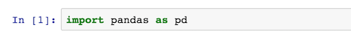
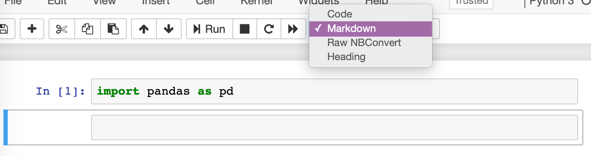
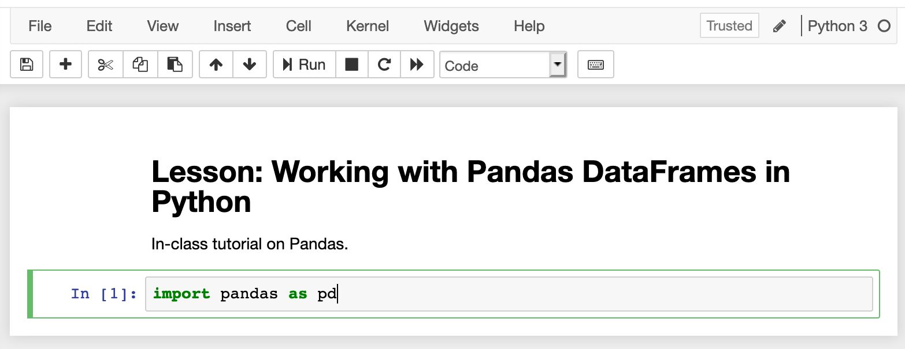
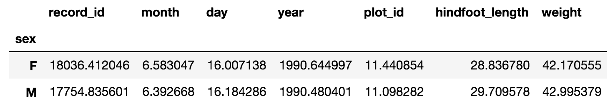
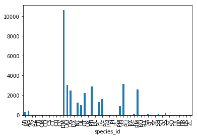
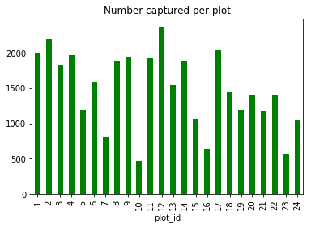
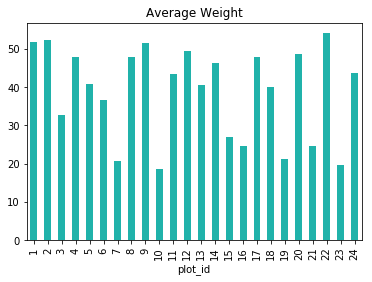
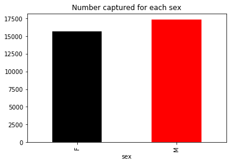
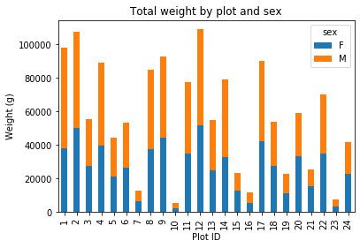
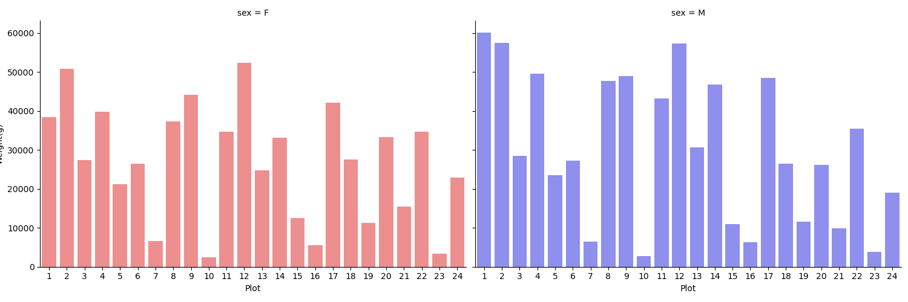

# Starting with Data

We can automate much of our research workflow using Python. It's efficient to spend time
building the code to perform these tasks because once it is built, we can use it
over and over on different datasets that use a similar format. This makes our
methods easy to reproduce and easy to adapt to new projects. We can also share our code with colleagues
and they can replicate the same analysis.

### Getting Set Up

To help the lesson run smoothly, let's ensure everyone is in the same directory.
This should help us avoid path and file name issues. At this time please
navigate to the directory containing the [course repository](https://github.com/mesfind/bioinfo-python/) on your computer. 
Before starting, be sure to **pull** the most recent changes from the repository using `git pull origin master`.
If you're working in Jupyter Notebook be sure
that you start your notebook in the `course-files/python` directory. If you do not have this directory, please see the instructions in the [Setup](../setup/) page.

You will want to use a Jupyter notebook or the Spyder IDE console to run this lesson. Both of these tools make it easy to view in-line plots.

To start a new Python session in a Jupyter notebook:

```
$ cd bioinfo-python
$ jupyter notebook
```

This typically brings up your default web browser and opens the Jupyter home screen.
Select **_New->Python 3_**. Name this session `03-pandas`.

Note that you can also start a Jupyter notebook from the Anaconda Navigator launch screen. This will likely open the notebook in your home directory and you can then navigate through your file system to get to the `bioinfo-python` directory.

Alternatively, you can start a Spyder instance and navigate to the `bioinfo-python` directory from the console using Unix commands. 


### Our Data 

For this lesson, we will be using the Portal Teaching data, a subset of the data
from the ecological study by Ernst et al. (2009):
[Long-term monitoring and experimental manipulation of a Chihuahuan Desert ecosystem near Portal, Arizona, USA](http://www.esapubs.org/archive/ecol/E090/118/default.htm)
Specifically, we will be using files from the [Portal Project Teaching Database](https://figshare.com/articles/Portal_Project_Teaching_Database/1314459).
https://raw.githubusercontent.com/mesfind/bioinfo-python/gh-pages/data/python-novice-inflammation-data.zip
* This section will use the `surveys.csv` file that can be downloaded from the 
[`bioinfo-python`](https://raw.githubusercontent.com/mesfind/bioinfo-python/gh-pages/data/surveys.csv) 
folder of the course repository.
Pull from the course repository and change to to `bioinfo-python` or copy the `surveys.csv` file to the directory from which you would like to work.

In this lesson, we are studying the species and weight of (_vertebrate_) animals captured in plots in our study
area. The observed data are stored as a `.csv` file (comma-separated value): each row holds information for a
single animal, and the columns represent:

| Column           | Description                        |
|------------------|------------------------------------|
| record_id        | Unique id for the observation      |
| month            | month of observation               |
| day              | day of observation                 |
| year             | year of observation                |
| plot_id          | ID of a particular plot            |
| species_id       | 2-letter code                      |
| sex              | sex of animal ("M", "F")           |
| hindfoot_length  | length of the hindfoot in mm       |
| weight           | weight of the animal in grams      |


The first few rows of our first file look like this:

```
record_id,month,day,year,plot_id,species_id,sex,hindfoot_length,weight
1,7,16,1977,2,NL,M,32,
2,7,16,1977,3,NL,M,33,
3,7,16,1977,2,DM,F,37,
4,7,16,1977,7,DM,M,36,
5,7,16,1977,3,DM,M,35,
6,7,16,1977,1,PF,M,14,
7,7,16,1977,2,PE,F,,
8,7,16,1977,1,DM,M,37,
9,7,16,1977,1,DM,F,34,
```


## Pandas in Python
One of the best options for working with tabular data in Python is to use the
[Python Data Analysis Library](http://pandas.pydata.org/) (a.k.a. Pandas). The
Pandas library provides data structures, produces high quality plots with
[matplotlib](http://matplotlib.org/) and integrates nicely with other libraries
that use [NumPy](http://www.numpy.org/) (which is another Python library) arrays.

Python does not load all available libraries by default. We have to
add an `import` statement to our code in order to use library functions. To import
a library, we use the syntax `import libraryName`. If we want to give the
library a nickname to shorten the command, we can add `as myNickName`.  

Import the pandas library using the common nickname `pd` is below.


~~~
import pandas as pd
~~~
{: .python}

If you're using a Jupyter notebook for this lesson, it should look like this:



Remember that the `import pandas as pd` syntax means that we have given the alias `pd` to the pandas library. Thus, we don't have to use the whole name when we invoke pandas functions.


<!-- Add Documenting Code call out -->

> ## Documenting Code
> Let's take a moment to talk about proper documentation again. 
> One major benefit of using Jupyter Notebooks is that it gives 
> us a way to provide clear and descriptive comments about our 
> code. This is a good place to write a description of this 
> notebook. 
>
> Add a new cell in your notebook and change the cell type to 
> _Markdown_. 
>
> 
>
> You can also use the arrow buttons to move this cell to the 
> top of your notebook.
>
> Now we can write a description of this notebook using Markdown.
>
> ```
> # Lesson: Working with Pandas DataFrames in Python
> 
> In-class tutorial on Pandas.
> ``` 
>
> 
{: .callout}

# Reading CSV Data Using Pandas

We will begin by locating and reading our survey data which are in CSV format.
We can use Pandas' `read_csv` function to pull the file directly into a
[DataFrame](http://pandas.pydata.org/pandas-docs/stable/dsintro.html#dataframe).

## What's a DataFrame?

A DataFrame is a 2-dimensional data structure that can store data of different
types (including characters, integers, floating point values, factors and more)
in columns. It is similar to a spreadsheet or an SQL table or the `data.frame` in
R. A DataFrame always has an index (0-based). An index refers to the position of 
an element in the data structure.

~~~
pd.read_csv("surveys.csv")
~~~
{: .python}


~~~
       record_id  month  day  year  plot_id species_id  sex  hindfoot_length  \
0              1      7   16  1977        2         NL    M             32.0   
1              2      7   16  1977        3         NL    M             33.0   
2              3      7   16  1977        2         DM    F             37.0   
3              4      7   16  1977        7         DM    M             36.0   
4              5      7   16  1977        3         DM    M             35.0   
5              6      7   16  1977        1         PF    M             14.0   
6              7      7   16  1977        2         PE    F              NaN   
7              8      7   16  1977        1         DM    M             37.0   
...          ...    ...  ...   ...      ...        ...   ...             ...
35547      35548     12   31  2002        7         DO    M             36.0   
35548      35549     12   31  2002        5        NaN  NaN              NaN   

       weight  
0         NaN  
1         NaN  
2         NaN  
3         NaN  
4         NaN  
5         NaN  
6         NaN  
7         NaN  
...       ...
35547    51.0  
35548     NaN  

[35549 rows x 9 columns]
~~~
{: .output}

We can see that there were 33,549 rows parsed into a DataFrame. Each row has 9
columns. The first column is the index of the DataFrame. The index is used to
identify the position of the data, but it is not an actual column of the DataFrame (it is not labeled). 

It looks like  the `read_csv` function in Pandas  read our file properly. However, we haven't saved any data to memory, and we cannot work with it until we do that.
We need to assign the DataFrame to a variable. 
Remember that a variable is a name for a value, such as `x`, 
or  `data`. We can create a new object with a variable name by assigning a value to it using the `=` operator.

Let's call the imported survey data `surveys_df`:

~~~
df = pd.read_csv("surveys.csv")
~~~
{: .python}

Notice when you assign the imported DataFrame to a variable, Python does not
produce any output on the screen. We can print the value of the `surveys_df`
object by typing its name into the Python command prompt. This will print the data frame just like above.

~~~
df
~~~
{: .python}


## Inspecting Our Species Survey DataFrame

Now we can start working with our data. First, let's check the data type of the
data stored in `surveys_df` using the `type` function. The `type` function and
`__class__` attribute tell us that `surveys_df` is `<class 'pandas.core.frame.DataFrame'>`.

~~~
type(df)
~~~
{: .python}

~~~
pandas.core.frame.DataFrame
~~~
{: .output}

The output is the same if you use this:

~~~
surveys_df.__class__
~~~
{: .python}

~~~
pandas.core.frame.DataFrame
~~~
{: .output}


We can also enter `surveys_df.dtypes` at our prompt to view the data type for each
column in our DataFrame. `int64` represents numeric integer values - `int64` cells
cannot store decimals. `object` represents strings (letters and numbers). `float64`
represents numbers with decimals.

~~~
df.dtypes
~~~
{: .python}


~~~
record_id            int64
month                int64
day                  int64
year                 int64
plot_id              int64
species_id          object
sex                 object
hindfoot_length    float64
weight             float64
dtype: object
~~~
{: .output}


### Useful Ways to View DataFrame objects in Python

There are multiple methods that can be used to summarize and access the data
stored in DataFrames. Note that we call the method by using
the object or method name `df.object` or `df.method()`. So `df.columns` provides an index
of all of the column names in our DataFrame.


> ## Querying DataFrames
>
> There are several methods that allow you to inspect your DataFrame. 
>
> Print the column names:
> 
> ~~~
> df.columns
> ~~~
> {: .python}
> 
> Print the _first_ `4` lines of the DataFrame
> 
> ~~~
> df.head(4)
> ~~~
> {: .python}
> 
> Print the _last_ `4` lines of the DataFrame
> 
> ~~~
> df.tail(4)
> ~~~
> {: .python}
> 
>  Print the dimensions of the DataFrame
> 
> ~~~
> df.shape
> ~~~
> {: .python}
{: .callout}

## Summarizing Data in a Pandas DataFrame

We've read our data into Python. Next, let's perform some quick summaries of the DataFrame to learn more about the data that we're working with. We might want
to know how many animals were collected in each plot, or how many of each
species were caught. We can summarize different aspects of our data using groups. But first we need to figure out what we want to group by.

Let's begin by exploring our data and view the column names:

~~~
df.columns
~~~
{: .python}

~~~
Index(['record_id', 'month', 'day', 'year', 'plot_id', 'species_id', 'sex',
       'hindfoot_length', 'weight'], dtype=object)
~~~
{: .output}

Let's get a list of all the species. The `pd.unique` method tells us all of
the unique values in the `species_id` column. These are two-character identifiers of the species names (e.g., `NL` represents the rodent [_Neotoma albigula_](https://en.wikipedia.org/wiki/White-throated_woodrat)).

~~~
pd.unique(df['species_id'])
~~~
{: .python}

~~~
array(['NL', 'DM', 'PF', 'PE', 'DS', 'PP', 'SH', 'OT', 'DO', 'OX', 'SS',
       'OL', 'RM', nan, 'SA', 'PM', 'AH', 'DX', 'AB', 'CB', 'CM', 'CQ',
       'RF', 'PC', 'PG', 'PH', 'PU', 'CV', 'UR', 'UP', 'ZL', 'UL', 'CS',
       'SC', 'BA', 'SF', 'RO', 'AS', 'SO', 'PI', 'ST', 'CU', 'SU', 'RX',
       'PB', 'PL', 'PX', 'CT', 'US'], dtype=object)
~~~
{: .output}

> ## How many plots were recorded for this dataset?
>
> 1. Create a list of unique plot ID's found in the surveys data. 
> Call it `plot_names`. How many unique plots are there in the data? 
> <!--How many unique species are in the data?-->
> 
> 2. Is there a simpler solution for doing this?
>
> > ## Solution
> > 
> > ~~~
> > # 1
> > plot_names = list(pd.unique(surveys_df['plot_id']))
> > print(len(plot_names))
> > 
> > # 2
> > print(surveys_df['plot_id'].nunique())
> > ~~~
> > {: .python}
> > 
> > Note that the `.nunique()` method does not count null (i.e., `nan`) values.
> {: .solution} 
{: .challenge}


# Groups in Pandas
n Pandas, grouping refers to the process of splitting a DataFrame or Series into multiple groups based on one or more criteria. The resulting groups can then be used to perform various operations, such as aggregation, transformation, or filtering. For instance, By using `value_counts()` in Pandas, you can efficiently group data by a specific column, such as 'species_id', and obtain a clear overview of the distribution of values within that column. This is a valuable tool for understanding the composition of categorical data and identifying patterns or imbalances in the dataset.

~~~
# Values with their counts in a particular column
df['species_id'].value_counts()
~~~
{: .python}
~~~
species_id
DM    10596
PP     3123
DO     3027
PB     2891
RM     2609
DS     2504
OT     2249
PF     1597
PE     1299
NL     1252
OL     1006
PM      899
AH      437
AB      303
SS      248
SH      147
SA       75
RF       75
CB       50
BA       46
SO       43
SF       43
DX       40
PC       39
PL       36
PH       32
CQ       16
CM       13
OX       12
UR       10
PI        9
UP        8
PG        8
RO        8
PX        6
SU        5
PU        5
US        4
UL        4
AS        2
RX        2
ZL        2
ST        1
CU        1
SC        1
CS        1
CT        1
CV        1
Name: count, dtype: int64
~~~
{: .output}

We also often want to calculate summary statistics grouped by subsets or attributes
within fields of our data. For example, we might want to calculate the average weight of all individuals per plot.

We can calculate basic statistics for all records in a single column using the
`.describe()` method:

~~~
df['weight'].describe()
~~~
{: .python}


~~~
count    32283.000000
mean        42.672428
std         36.631259
min          4.000000
25%         20.000000
50%         37.000000
75%         48.000000
max        280.000000
Name: weight, dtype: float64
~~~
{: .output}

We can also extract one specific metric if we wish:

Like the lowest `weight` 

~~~
df['weight'].min()
~~~
{: .python}

~~~
4.0
~~~
{: .output}

The maximum `weight`

~~~
df['weight'].max()
~~~
{: .python}

~~~
280.0
~~~
{: .output}

The `mean` of the `weight` column

~~~
df['weight'].mean()
~~~
{: .python}

~~~
42.672428212991356
~~~
{: .output}

The standard deviation of the `weight`

~~~
df['weight'].std()
~~~
{: .python}

~~~
36.63125947458399
~~~
{: .output}

Count the number of observations made for weight:

~~~
df['weight'].count()
~~~
{: .python}

~~~
32283
~~~
{: .output}

But if we want to summarize by one or more variables, for example the weight for each sex, we need to
use the Pandas DataFrame `.groupby()` method. Once we've created a re-orgaized DataFrame, we
can quickly calculate summary statistics by a group of our choice.

Group data by the sex of each observed individual:

~~~
sorted_df = df.groupby('sex')
~~~
{: .python}

The method `.describe()` will return descriptive stats including: mean,
median, max, min, std and count for a particular column in the data. Pandas'
`.describe()` method will only return summary values for columns containing
numeric data.
With the sorted data, we can obtain the summary statistics for the weight column separated by sex. 

~~~
sorted_df['weight'].describe()
~~~
{: .python}

~~~
       count       mean        std  min   25%   50%   75%    max
sex                                                             
F    15303.0  42.170555  36.847958  4.0  20.0  34.0  46.0  274.0
M    16879.0  42.995379  36.184981  4.0  20.0  39.0  49.0  280.0
~~~
{: .output}


We can also get the mean for each numeric-valued column, grouped by sex:

~~~
sorted_df.mean()
~~~
{: .python}




<!--~~~
        record_id     month        day         year    plot_id  \
sex                                                              
F    18036.412046  6.583047  16.007138  1990.644997  11.440854   
M    17754.835601  6.392668  16.184286  1990.480401  11.098282   

     hindfoot_length     weight  
sex                              
F          28.836780  42.170555  
M          29.709578  42.995379  

~~~
{: .output}
-->
The `.groupby()` method is powerful in that it allows us to quickly generate
summaries of categorical data.

> ## How many individuals were recorded as female and how many were male?
>
> Using the `.describe()` method on the DataFrame sorted by sex, 
> determine how many individuals were observed for each.
>
> > ## Solution
> > 
> > * *Female* = 15690
> > 
> > * *Male* = 17348
> > 
> {: .solution}
{: .challenge}


> ## Group by two columns
>
> What happens when you group by two columns and 
> then view mean values:
> - Hint: you can use a list in the arguments of the `.groupby()` method, `['plot_id','sex']`
> 
> > ## Solution
> > 
> > ~~~
> > sorted_df2 = surveys_df.groupby(['plot_id','sex'])
> > sorted_df2.mean()
> > ~~~
> > {: .python}
> {: .solution} 
{: .challenge}


> ## Summarize a single column
>
> Summarize weight values for each plot in your data.
> 
> > ## Solution
> > 
> > ~~~
> > by_plot = df.groupby('plot_id')
> > by_plot['weight'].describe()
> > ~~~
> > {: .python}
> {: .solution} 
{: .challenge}


## Quickly Creating Summary Counts in Pandas
{: #quicksumm }

Let's next count the number of samples for each species. We can do this in a few
ways, but we'll use `groupby` combined with a `count()` method.


~~~
species_counts = df.groupby('species_id')['record_id'].count()
species_counts
~~~
{: .python}

~~~
species_id
AB      303
AH      437
AS        2
BA       46
CB       50
CM       13
CQ       16
...
~~~
{: .output}


Or, we can also count just the rows that have the species "PL" (_Peromyscus leucopus_):

~~~
df.groupby('species_id')['record_id'].count()['PL']
~~~
{: .python}

~~~
36
~~~
{: .output}

## Treating missing values

Treating missing values in a dataset is a crucial step in data preprocessing to ensure the accuracy and reliability of the analysis. When dealing with missing values in Pandas, there are several common strategies for handling them effectively

### Identifying Missing Values

Use methods like `isnull()`` or `isna()`` to identify missing values in the dataset. Apply `sum()`` to count the number of missing values in each column, as shown in `df.isnull().sum()` on the entire dataframe.

~~~
# on whole df.
df.isnull().sum()
~~~
{: .python}

~~~
record_id             0
month                 0
day                   0
year                  0
plot_id               0
species_id          763
sex                2511
hindfoot_length    4111
weight             3266
~~~
{: .output}

Knowing the distribution of missing values across different columns is crucial for making informed decisions about data quality and the appropriate data handling techniques to use in your analysis.

~~~
# on a particular column
df['sex'].isnull().sum()

~~~
{: .python}


~~~
2511
~~~
{: .output}

The code `df['sex'].isnull().sum()` in Pandas is used to count the number of missing or null values in the `sex` column of the DataFrame df.

### Handling Missing Values

Handling missing values in a dataset is a critical aspect of data preprocessing to ensure the accuracy and reliability of data analysis. Various methods can be employed to effectively manage missing values in a dataset. Here are some common strategies for handling missing values:

Handling missing values in a dataset is a critical aspect of data preprocessing to ensure the accuracy and reliability of data analysis. Various methods can be employed to effectively manage missing values in a dataset. Here are some common strategies for handling missing values:

1. **Dropping Missing Values**:
   - One approach is to remove rows or columns with missing values using the `dropna()` function.
   - This method can be effective when the missing values are sporadic and removing them does not significantly impact the analysis.

2. **Imputing Missing Values**:
   - Missing values can be replaced with a specific value like the mean, median, mode, or a constant using the `fillna()` function.
   - Imputation helps retain data integrity and can be beneficial for maintaining dataset size and structure.

3. **Interpolation**:
   - Interpolation methods, such as the `interpolate()` function, estimate missing values based on existing data points.
   - This method is useful for filling missing values in ordered datasets or time series data.

4. **Replacing Missing Values**:
   - Instead of deleting entire rows, missing values can be replaced with a specified value using the `fillna()` function.
   - This approach helps maintain the dataset's completeness while handling missing values effectively.

5. **Domain Knowledge**:
   - Consider the domain-specific context to determine the most appropriate method for handling missing values.
   - Understanding the data and the implications of different strategies is crucial for making informed decisions.

6. **Evaluation**:
   - Always evaluate the impact of the chosen method on the dataset and the analysis results.
   - Monitor changes in data distribution and statistical properties after treating missing values.

#### Drop Missing Values

~~~
# You can also check the percentage of missing values
missing_percentage_sex = df['sex'].isnull().mean() * 100
missing_percentage_sex
~~~
{: .python}

~~~
7.063489830937579
~~~
{: .output}


~~~
df_sex = df.dropna(subset=['sex'])
df_sex.head()
~~~

~~~
   record_id  month  day  year  plot_id species_id sex  hindfoot_length  weight
0          1      7   16  1977        2         NL   M             32.0     NaN
1          2      7   16  1977        3         NL   M             33.0     NaN
2          3      7   16  1977        2         DM   F             37.0     NaN
3          4      7   16  1977        7         DM   M             36.0     NaN
4          5      7   16  1977        3         DM   M             35.0     NaN
~~~
{: .output}

#### Missing values imputation with zscore

The z-score method is a common approach for identifying and imputing missing values in a dataset. The key steps involved are:
1. Calculating the z-score for each data point:
    -  The z-score is a standardized measure that represents how many standard deviations a data point is from the mean.
    -  It is calculated as: \(z = (x - \mu) / \sigma\), where x is the data point, μ is the mean, and σ is the standard deviation.
2. Identifying potential values to impute missing data:
   - The z-score method compares the z-scores of the non-missing values to identify potential values that could be used to impute the missing ones.
    - This is based on the idea that data points with similar z-scores are likely to have similar underlying values.
3. Imputing the missing values:
    - Once the potential imputation values are identified, the missing values can be replaced with the most appropriate value, such as the mean or median of the similar z-score data points.

~~~
# Import the zscore function from scipy.stats
from scipy.stats import zscore

# Drop rows with missing values in the 'weight' column
df.dropna(subset=['weight'], inplace=True)

# Calculate z-scores for the 'weight' column
df['weight_zscore'] = zscore(df['weight'])
mean_weight = df['weight'].mean()
std_weight = df['weight'].std()

# Function to impute missing values using z-score
def impute_missing_with_zscore(row):
    if pd.isnull(row['weight']):
        return (row['weight_zscore'] * std_weight) + mean_weight
    else:
        return row['weight']

# Apply the imputation function to fill missing values in 'weight' column
df['weight_imputed'] = df.apply(impute_missing_with_zscore, axis=1)

# Drop the intermediate 'weight_zscore' column if needed
df.drop(columns=['weight_zscore'], inplace=True)
df.head()
~~~
{: .python}


~~~

    record_id  month  day  year  plot_id species_id sex  hindfoot_length  weight  weight_imputed
62         63      8   19  1977        3         DM   M             35.0    40.0            40.0
63         64      8   19  1977        7         DM   M             37.0    48.0            48.0
64         65      8   19  1977        4         DM   F             34.0    29.0            29.0
65         66      8   19  1977        4         DM   F             35.0    46.0            46.0
66         67      8   19  1977        7         DM   M             35.0    36.0            36.0

~~~
{: .output}


#### imputation with median

~~~
df['hindfoot_length'] = df['hindfoot_length'].fillna(df['hindfoot_length'].median())
df.head()
~~~
{: .python}

~~~
    record_id  month  day  year  plot_id species_id sex  hindfoot_length  weight  weight_imputed
62         63      8   19  1977        3         DM   M             35.0    40.0            40.0
63         64      8   19  1977        7         DM   M             37.0    48.0            48.0
64         65      8   19  1977        4         DM   F             34.0    29.0            29.0
65         66      8   19  1977        4         DM   F             35.0    46.0            46.0
66         67      8   19  1977        7         DM   M             35.0    36.0            36.0
~~~
{: .output}

#### forward fill impuation 

~~~
# Impute missing values using forward fill (ffill)
df['sex'] = df['sex'].ffill()

~~~
{: .python}


## Basic Math Functions

If we wanted to, we could perform math on an entire column of our data. For
example let's multiply all weight values by 2. A more practical use of this might
be to normalize the data according to a mean, area, or some other value
calculated from our data.

Multiply all weight values by 2 and store values in a Pandas object called `double_weight`:

~~~
double_weight = df['weight'] * 2
~~~
{: .python}

If we summarize `double_weight`, then the summary will indicate that these values are twice the original weights:

~~~
double_weight.describe()
~~~
{: .python}

~~~
count    32283.000000
mean        85.344856
std         73.262519
min          8.000000
25%         40.000000
50%         74.000000
75%         96.000000
max        560.000000
Name: weight, dtype: float64
~~~
{: .output}

# Quick & Easy Plotting Using Pandas

We can plot our summary stats using Pandas, too. 


Now, we can make a quick bar chart of the species counts

~~~
species_counts.plot(kind='bar',title='Number of individuals per species')
~~~
{: .python}




We can also look at how many animals were captured in each plot:

~~~
total_count = df.groupby('plot_id')['record_id'].nunique()
~~~
{: .python}

And plot a bar chart describing the number of individuals captured at each plot. Also, let's make it so that all of the bars are colored green.

~~~
total_count.plot(kind='bar',title='Number captured per plot', color='green')
~~~
{: .python}




> ## Plot the average weight across all species in each plot
>
> Create a bar plot that shows the average weight of all of the animals captured in that plot.
> Also, choose an interesting or pleasing color from the list of [named web colors](https://en.wikipedia.org/wiki/Web_colors).
> 
> > ## Solution
> > 
> > ~~~
> > plot_weight_means = surveys_df.groupby('plot_id')['weight'].mean()
> > plot_weight_means.plot(kind='bar',title='Average Weight (g)',color='LightSeaGreen')
> > ~~~
> > {: .python}
> > 
> > 
> {: .solution} 
{: .challenge}

> ## Plot the number of females and the number of males in the dataset
>
> Create a bar plot that shows the total number of each sex captured for the entire dataset.
> 
> > ## Solution
> > 
> > ~~~
> > counts_by_sex = surveys_df['record_id'].groupby(surveys_df['sex']).count()
> > counts_by_sex.plot(kind='bar',title='Number captured for each sex',color=['k', 'r'])
> > ~~~
> > {: .python}
> > 
> > 
> {: .solution}
{: .challenge}


# More Fun with Plotting

Now we will plot something a little bit more difficult. We will use a stacked bar plot to show how both weight and sex are distributed across each plot in the study. 

First we group data by plot and by sex, and then calculate a total for each plot.

~~~
by_plot_sex = surveys_df.groupby(['plot_id','sex'])
plot_sex_count = by_plot_sex['weight'].sum()
plot_sex_count
~~~
{: .python}

This calculates the sums of weights for each sex within each plot as a table

~~~
plot  sex
plot_id  sex
1        F      38253
         M      59979
2        F      50144
         M      57250
3        F      27251
         M      28253
4        F      39796
         M      49377
...
~~~
{: .output}

Then we'll use `.unstack()` on our grouped data to figure out the total weight that each sex contributed to each plot.

~~~
plot_sex_count.unstack()
~~~
{: .python}

~~~
sex            F        M
plot_id                  
1        38253.0  59979.0
2        50144.0  57250.0
3        27251.0  28253.0
4        39796.0  49377.0
5        21143.0  23326.0
6        26210.0  27245.0
7         6522.0   6422.0
...
~~~
{: .output}

Now, create a stacked bar plot with those data where the weights for each sex are stacked by plot.

~~~
spc = plot_sex_count.unstack()
s_plot = spc.plot(kind='bar',stacked=True,title="Total weight by plot and sex")
s_plot.set_ylabel("Weight (g)")
s_plot.set_xlabel("Plot")
~~~
{: .python}
<!-- redo plot -->




### Facet Plot

A facet plot, also known as a trellis plot or small multiple plot, is a visualization technique that displays multiple plots or graphs in a grid arrangement. Each subplot in the grid represents a subset of the data, often distinguished by one or more categorical variables

~~~
import seaborn as sns
import matplotlib.pyplot as plt

# Grouping by plot_id and sex, and summing the weight
plot_sex_count = df.groupby(['plot_id', 'sex'])['weight'].sum().reset_index()

# Unstacking the dataframe
spc = plot_sex_count.pivot(index='plot_id', columns='sex', values='weight')

# Define custom colors for the sex categories
custom_palette = {"M": "blue", "F": "red"}

# Creating the facet grid with adjusted size and aspect ratio
g = sns.FacetGrid(plot_sex_count, col="sex", height=5, aspect=2)
g.map_dataframe(sns.barplot, x='plot_id', y='weight', hue='sex', palette=custom_palette,alpha=0.5)
g.set_axis_labels("Plot", "Weight(g)")

# Adjusting the facet grid layout
g.fig.tight_layout()

# Applying the figure size to the FacetGrid object
g.fig.set_figwidth(15)
g.fig.set_figheight(5)

plt.savefig("pandas_plot_sex_count_survey.png")
plt.show()


~~~
{: .python}

The above code snippet is  :

- A facet grid plot is generated using the Seaborn library in Python.
- The data is grouped by 'plot_id' and 'sex', and the weight is summed within each group.
- Subplots are created for each unique value of the 'sex' variable, arranged in a grid layout.
- Bar plots are plotted within each subplot, showing the distribution of weight across different plot IDs.
- Customization options such as axis labels and color palettes are applied to enhance readability and interpretation.
- The size of the entire figure is adjusted to ensure proper visualization.
- Finally, the plot is saved as an image file and displayed for analysis.




> ## Take-Home Challenge: More Fun with DataFrames and Plotting
>
> Continue working with the `surveys_df` DataFrame on the following challenges:
>
> 1. Plot the average weight over all species and plots sampled each year (i.e., year on the horizontal axis and average weight on the vertical axis).
>
> 2. Come up with another way to view and/or summarize the observations in this dataset. What do you learn from this?
>
> > ## Solutions
> >
> > The solutions will be posted in a few days. Feel free to use the `#scripting_help` channel in Slack to discuss these exercises. 
> {: .solution}
{: .challenge}