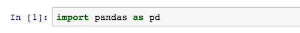

# Starting with Biological Data

We can automate much of our research workflow using Python. It's efficient to spend time
building the code to perform these tasks because once it is built, we can use it
over and over on different datasets that use a similar format. This makes our
methods easy to reproduce and easy to adapt to new projects. We can also share our code with colleagues
and they can replicate the same analysis.

### Getting Set Up

To help the lesson run smoothly, let's ensure everyone is in the same directory.
This should help us avoid path and file name issues. At this time please
navigate to the directory containing the [course repository](https://github.com/mesfind/bioinfo-python/) on your computer. 
Before starting, be sure to **pull** the most recent changes from the repository using `git pull origin main`.
If you're working in Jupyter Notebook be sure
that you start your notebook in the `course-files/python` directory. If you do not have this directory, please see the instructions in the [Setup](../setup/) page.

You will want to use a Jupyter notebook or the Spyder IDE console to run this lesson. Both of these tools make it easy to view in-line plots.

To start a new Python session in a Jupyter notebook:

```bash
$ cd bioinfo-python
$ jupyter notebook
```

This typically brings up your default web browser and opens the Jupyter home screen.
Select **_New->Python 3_**. Name this session `03-pandas-bio`.

Note that you can also start a Jupyter notebook from the Anaconda Navigator launch screen. This will likely open the notebook in your home directory and you can then navigate through your file system to get to the `bioinfo-python` directory.

Alternatively, you can start a Spyder instance and navigate to the `bioinfo-python` directory from the console using Unix commands.

### Our Biological Data

For this lesson, we will be using biological sequence data and associated metadata. This dataset contains information about DNA sequences from various organisms, including:
- Sequence identifiers
- Organism names
- GC content
- Sequence length
- Gene names
- Functional annotations

The observed data are stored as a `.csv` file (comma-separated value): each row holds information for a
single sequence, and the columns represent:

| Column           | Description                        |
|------------------|------------------------------------|
| seq_id           | Unique sequence identifier         |
| organism         | Organism name                      |
| gene             | Gene name                          |
| sequence         | DNA sequence                       |
| length           | Sequence length in bp              |
| gc_content       | GC content (percentage)            |
| protein_id       | Protein identifier                 |
| function         | Functional annotation              |
| taxonomy         | Taxonomic classification           |

The first few rows of our data file look like this:

```
seq_id,organism,gene,sequence,length,gc_content,protein_id,function,taxonomy
seq001,Homo sapiens,BRCA1,ATGGATTTATCTGCTCTTCGCGTTGAAGAAGTACAAAATGTCATTAATGCTATGCAGAAAATCTTAGAGTGTCCCATCTGTCTGGAGTTGATCAAGGAACCTGTCTCCACAAAGTGTGACCACATATTTTGCAAATTTTGTATGCTGAAACTTCTCAACCAGAAGAAAGGGCCTTCACAGTGTCCTTTATGTAAGAATGATATAACCAAAAGGAGCCTACAAGAAAGTACGAGATTTAGTCAACTTGTTGAAGAGCTATTGAAAATCATTTGTGCTTTTCAGCTTGACACAGGTTTGGAGTATGCAAACAGCTATAATTTTGCAAAAAAGGAAAATAACTCTCCTGAACATCTAAAAGATGAAGTTTCTATCATCCAAAGTATGGGCTACAGAAACCGTGCCAAAAGACTTCTACAGAGTGAACCCGAAAATCCTTCCTTGCAGGAAACCAGTCTCAGTGTCCAACTCTCTAACCTTGGAACTGTGAGAACTCTGAGGACAAAGCAGCGGATACAACCTCAAAAGACGTCTGTCTACATTGAATTGGGATCTGATTCTTCTGAAGATACCGTTAATAAGGCAACTTATTGCAGTGTGGGAGATCAAGAATTGTTACAAATCACCCCTCAAGGAACCAGGGATGAAATCAGTTTGGATTCTGCAAAAAAGGCTGCTTGTGAATTTTCTGAGACGGATGTAACAAATACTGAACATCATCAACCCAGTAATAATGATTTGAACACCACTGAGAAGCGTGCAGCTGAGAGGCATCCAGAAAAGTATCAGGGTAGTTCTGTTTCAAACTTGCATGTGGAGCCATGTGGCACAAATACTCATGCCAGCTCATTACAGCATGAGAACAGCAGTTTATTACTCACTAAAGACAGAATGAATGTAGAAAAGGCTGAATTCTGTAATAAAAGCAAACAGCCTGGCTTAGCAAGGAGCCAACATAACAGATGGGCTGGAAGTAAGGAAACATGTAATGATAGGCGGACTCCCAGCACAGAAAAAAAGGTAGATCTGAATGCTGATCCCCTGTGTGAGAGAAAAGAATGGAATAAGCAGAAACTGCCATGCTCAGAGAATCCTAGGGATACTGAAGATGTTCCTTGGATAACACTAAATAGCAGCATT
seq002,Homo sapiens,BRCA2,ACTGCATTTGAATTGAAGAGTGACACAGTTGAGACAGTTGCTGAGTCTAAATCATATAAAGTAAACATGATATGAAAATAATATAATTTGTATAGTATTAATATTTATTTAGAAATATGTATATGTGTAGTAATGTGTGTGTGTGTGTGTGTGTGTATGTATGTGTATATATATACACACATTTTCCTCTGAAACATCTGAACATATATATTATACAATACTCAATGCATAATTTATATATGAATGTAAACATTTAAATATATAAATATACATATATATTTTAAATATTTATATTTATAAATTTTTAAATATTTTGGTAGAGAAAAATATTTTAAAACACATTTATATATATTTATATACATGAATAAATGTTTATAAATATACATTTATATATATATATATATATATATATATATATATATATATATATATATATATATATATATATATATATATATATATATTTAGATATTGAATATTTTGAACTAAATATTACAGTGGTATTTTAAAAATGGGAAAGCATATACATATACATATATTTTTTTAAT
seq003,Homo sapiens,TP53,ATGGAGGAGCCGCAGTCAGATCCTAGCGTCGAGCCCCCTCTGAGTCAGGAAACATTTTCAGACCTATGGAAACTACTTCCTGAAAACAACGTTCTGTCCCCCTTGCCGTCCCAAGCAATGGATGATTTGATGCTGTCCCCGGACGATATTGAACAATGGTTCACTGAAGACCCAGGTCCAGATGAAGCTCCCAGAATGCCAGAGGCTGCTCCCCCCGTGGCCCCTGCACCAGCAGCTCCTACACCGGCGGCCCCTGCACCAGCCCCCTCCTGGCCCCTGTCATCTTCTGTCCCTTCCCAGAAAACCTACCAGGGCAGCTACGGTTTCCGTCTGGGCTTCTTGCATTCTGGGACAGCCAAGTCTGTGACTTGCACGTACTCCCCTGCCCTCAACAAGATGTTTTGCCAACTGGCCAAGACCTGCCCTGTGCAGCTGTGGGTTGATTCCACACCCCCGCCCGGCACCCGCGTCCGCGCCATGGCCATCTACAAGCAGTCACAGCACATGACGGAGGTTGTGAGGCGCTGCCCCCACCATGAGCGCTGCTCAGATAGCGATGGTCTGGCCCCTCCTCAGCATCTTATCCGAGTGGAAGGAAATTTGCGTGTGGAGTATTTGGATGACAGAAACACTTTTCGACATAGTGTGGTGGTGCCCTATGAGCCGCCTGAGGTTGGCTCTGACTGTACCACCATCCACTACAACTACATGTGTAACAGTTCCTGCATGGGCGGCATGAACCGGAGGCCCATCCTCACCATCATCACACTGGAAGACTCCAGTGGTAATCTACTGGGACGGAACAGCTTTGAGGTGCGTGTTTGTGCCTGTCCTGGGAGAGACCGGCGCACAGAGGAAGAGAATCTCCGCAAGAAAGGGGAGCCTCACCACGAGCTGCCCCCAGGGAGCACTAAGCGAGCACTGCCCAACAACACCAGCTCCTCTCCCCAGCCAAAGAAGAAACCACTGGATGGAGAATATTTCACCCTTCAGATCCGTGGGCGTGAGCGCTTCGAGATGTTCCGAGAGCTGAATGAGGCCTTGGAACTCAAGGATGCCCAGGCTGGGAAGGAGCCAGGGGGGAGCAGGGCTCACTCCAGCCACCTGAAGTCCAAAAAGGGTCAGTCTACCTCCCGCCATAAAAAACTCATGTTCAAGACAGAAGGGCCTGACTCAGACTGACATTCTCCACTTCTTGTTCCCCACTGACAGCCTCCCACCCCCATCTCTCCCCCTGCCCTGCCATTTTGGGTTTTGGGTCTTTGAACCCTTGCTTGCAATAGGTGTGCGTCAGAAGCACCCAGGACTTCCATTTGCTTTGTCCCGGGGCTCCACTGAACAAGTTGGCCTGCACTGGTGTTTTGTTGTGGGGAGGAGGATGGGGAGTAGGACATACCAGCTTAGATTTTAAGGTTTTTACTGTGAGGGATGTTTGGGAGATGTAAGAAATGTTCTTGCAGTTAAGGGTTAGTTTACAATCAGCCACATTCTAGGTAGGGGCCCACTTCACCGTACTAAACCAGGGGAGCTGTCTCCACCATGGACTGCTCTCCCCACCTGATGGTGGCTCAAGGAAGAAAGAAGTCCTCTCCTTAAGGCATGGCCTCTTCATTTAGAGATTTCATGTTTATATAGTGATGTGATTTACAGTATGTGGAATATCACTATGGGTTGCAACTTAAACATGGTTGTCTTTTGACTAGACATTTTCCCAAGGTACAGAATTGCCAGTGGATGTGACAATGCATTGTTTCCAGATGGGATGAGGGTGGGGAGTGACTCGGCCCAGGGGGTTCTGGAGAATCTGAGATTTTCAGTTTTGGAAGAGATTTGGGGAGGGAAATTTTTCACTGAGCAGATGAGCATTTCAGATACAGCCCAT
seq004,Homo sapiens,EGFR,AAATTCCGTGTGAGAGAGAGAGAAACCTGCAGCAGTCAGAGGGGGGAGGAAAGCAGCAGCAAGGGAGAGAGACACATTACTTTTTTTTTTTTTTTTTTTTTTTTTGAGACAGTCTCACTGTCGCCCAGGCTGGAGTGCAGTGGCATGATCTCAGCTCACTGCAACTTCCACCTCCCAGGTTCAAGTGATTCTCCTGCCTCAGCCTCCTGAGTAGCTGGGATTACAGGCACCTGCCACCATGCCCGGCTAATTTTTTATTTTTAGTAGAGACGGGGTTTCACCATGTTGGCCAGGCTGGTCTCAAACTCCTGACCTCAGGTGATCCACCCGCCTCGGCCTCCCAAAGTGCTGGGATTACAGGCGTGAGCCACCGCGCCCGGCCTAGATACATTTCCTTA
seq005,Homo sapiens,MYC,ATGGACTTTGGTTTTGGGGAGGGGGTCTTTTATTTTGATAATGAGGACGGGGGAGGGGGAGGGGGAGGGGAATAAAATAGGAGGGGCGGGTAGCGGGGGTTTAATGGGGGGGAGGGGAGGGGAGGGGATAAATGAATTTTGTGTGGGCGAGGAGGAGGAGGAGGAGGAGGAGGAGGAGATGCATGGTACCTTCTCTAGGAAATAAATGGATTTTTTCTTTAGATATAATGGGGAAGAAGATGAAATTAGGTGGCATGGGTAAAGTTATATTAAAGGGAGAGGGAGGAAGAGGGGCTGGGAGGGGACGAGGGGAGGGAGGGAGGGATGGGGGATGGATGGAGGGGGAGGGAGGGAGGGAGGGAGGGAGGGAGGGAGGGAGGGAGGGAGGGAGGGAGGGAGGGGTAGGGTGGGGGGAGGGGAGGGAGGGAGGGAGGGAGGGAGGGAGGGAAATAAATGATAAACATCAACAAACGAAACAATGTGATTGAGTACAAAACAGGATAAAACTCAAAAAGACCTCTCAGATTATTTTCCTCCTTTATATTTTCCTTTACTTTCCTTGTTTTTTCCTTTTTCTTTATTTTTTGGGTCATAAAAAATCCCCCTTTTTTATT
seq006,Mus musculus,Brca1,ATGGATTTATCTGCTCTTCGTGTTGAAGAAGTACAAAATGTCATTAATGCTATGCAGAAAATCTTAGAGTGTCCCATCTGTCTGGAGTTGATCAAGGAACCTGTCTCCACAAAGTGTGACCACATATTTTGCAAATTTTGTATGCTGAAACTTCTCAACCAGAAGAAAGGGCCTTCACAGTGTCCTTTATGTAAGAATGATATAACCAAAAGGAGCCTACAAGAAAGTACGAGATTTAGTCAACTTGTTGAAGAGCTATTGAAAATCATTTGTGCTTTTCAGCTTGACACAGGTTTGGAGTATGCAAACAGCTATAATTTTGCAAAAAAGGAAAATAACTCTCCTGAACATCTAAAAGATGAAGTTTCTATCATCCAAAGTATGGGCTACAGAAACCGTGCCAAAAGACTTCTACAGAGTGAACCCGAAAATCCTTCCTTGCAGGAAACCAGTCTCAGTGTCCAACTCTCTAACCTTGGAACTGTGAGAACTCTGAGGACAAAGCAGCGGATACAACCTCAAAAGACGTCTGTCTACATTGAATTGGGATCTGATTCTTCTGAAGATACCGTTAATAAGGCAACTTATTGCAGTGTGGGAGATCAAGAATTGTTACAAATCACCCCTCAAGGAACCAGGGATGAAATCAGTTTGGATTCTGCAAAAAAGGCTGCTTGTGAATTTTCTGAGACGGATGTAACAAATACTGAACATCATCAACCCAGTAATAATGATTTGAACACCACTGAGAAGCGTGCAGCTGAGAGGCATCCAGAAAAGTATCAGGGTAGTTCTGTTTCAAACTTGCATGTGGAGCCATGTGGCACAAATACTCATGCCAGCTCATTACAGCATGAGAACAGCAGTTTATTACTCACTAAAGACAGAATGAATGTAGAAAAGGCTGAATTCTGTAATAAAAGCAAACAGCCTGGCTTAGCAAGGAGCCAACATAACAGATGGGCTGGAAGTAAGGAAACATGTAATGATAGGCGGACTCCCAGCACAGAAAAAAAGGTAGATCTGAATGCTGATCCCCTGTGTGAGAGAAAAGAATGGAATAAGCAGAAACTGCCATGCTCAGAGAATCCTAGGGATACTGAAGATGTTCCTTGGATAACACTAAATAGCAGCATT
seq007,Mus musculus,Brca2,ACTGCATTTGAATTGAAGAGTGACACAGTTGAGACAGTTGCTGAGTCTAAATCATATAAAGTAAACATGATATGAAAATAATATAATTTGTATAGTATTAATATTTATTTAGAAATATGTATATGTGTAGTAATGTGTGTGTGTGTGTGTGTGTGTATGTATGTGTATATATATACACACATTTTCCTCTGAAACATCTGAACATATATATTATACAATACTCAATGCATAATTTATATATGAATGTAAACATTTAAATATATAAATATACATATATATTTTAAATATTTATATTTATAAATTTTTAAATATTTTGGTAGAGAAAAATATTTTAAAACACATTTATATATATTTATATACATGAATAAATGTTTATAAATATACATTTATATATATATATATATATATATATATATATATATATATATATATATATATATATATATATATATATATATATATATTTAGATATTGAATATTTTGAACTAAATATTACAGTGGTATTTTAAAAATGGGAAAGCATATACATATACATATATTTTTTTAAT
seq008,Mus musculus,Tp53,ATGGAGGAGCCGCAGTCAGATCCTAGCGTCGAGCCCCCTCTGAGTCAGGAAACATTTTCAGACCTATGGAAACTACTTCCTGAAAACAACGTTCTGTCCCCCTTGCCGTCCCAAGCAATGGATGATTTGATGCTGTCCCCGGACGATATTGAACAATGGTTCACTGAAGACCCAGGTCCAGATGAAGCTCCCAGAATGCCAGAGGCTGCTCCCCCCGTGGCCCCTGCACCAGCAGCTCCTACACCGGCGGCCCCTGCACCAGCCCCCTCCTGGCCCCTGTCATCTTCTGTCCCTTCCCAGAAAACCTACCAGGGCAGCTACGGTTTCCGTCTGGGCTTCTTGCATTCTGGGACAGCCAAGTCTGTGACTTGCACGTACTCCCCTGCCCTCAACAAGATGTTTTGCCAACTGGCCAAGACCTGCCCTGTGCAGCTGTGGGTTGATTCCACACCCCCGCCCGGCACCCGCGTCCGCGCCATGGCCATCTACAAGCAGTCACAGCACATGACGGAGGTTGTGAGGCGCTGCCCCCACCATGAGCGCTGCTCAGATAGCGATGGTCTGGCCCCTCCTCAGCATCTTATCCGAGTGGAAGGAAATTTGCGTGTGGAGTATTTGGATGACAGAAACACTTTTCGACATAGTGTGGTGGTGCCCTATGAGCCGCCTGAGGTTGGCTCTGACTGTACCACCATCCACTACAACTACATGTGTAACAGTTCCTGCATGGGCGGCATGAACCGGAGGCCCATCCTCACCATCATCACACTGGAAGACTCCAGTGGTAATCTACTGGGACGGAACAGCTTTGAGGTGCGTGTTTGTGCCTGTCCTGGGAGAGACCGGCGCACAGAGGAAGAGAATCTCCGCAAGAAAGGGGAGCCTCACCACGAGCTGCCCCCAGGGAGCACTAAGCGAGCACTGCCCAACAACACCAGCTCCTCTCCCCAGCCAAAGAAGAAACCACTGGATGGAGAATATTTCACCCTTCAGATCCGTGGGCGTGAGCGCTTCGAGATGTTCCGAGAGCTGAATGAGGCCTTGGAACTCAAGGATGCCCAGGCTGGGAAGGAGCCAGGGGGGAGCAGGGCTCACTCCAGCCACCTGAAGTCCAAAAAGGGTCAGTCTACCTCCCGCCATAAAAAACTCATGTTCAAGACAGAAGGGCCTGACTCAGACTGACATTCTCCACTTCTTGTTCCCCACTGACAGCCTCCCACCCCCATCTCTCCCCCTGCCCTGCCATTTTGGGTTTTGGGTCTTTGAACCCTTGCTTGCAATAGGTGTGCGTCAGAAGCACCCAGGACTTCCATTTGCTTTGTCCCGGGGCTCCACTGAACAAGTTGGCCTGCACTGGTGTTTTGTTGTGGGGAGGAGGATGGGGAGTAGGACATACCAGCTTAGATTTTAAGGTTTTTACTGTGAGGGATGTTTGGGAGATGTAAGAAATGTTCTTGCAGTTAAGGGTTAGTTTACAATCAGCCACATTCTAGGTAGGGGCCCACTTCACCGTACTAAACCAGGGGAGCTGTCTCCACCATGGACTGCTCTCCCCACCTGATGGTGGCTCAAGGAAGAAAGAAGTCCTCTCCTTAAGGCATGGCCTCTTCATTTAGAGATTTCATGTTTATATAGTGATGTGATTTACAGTATGTGGAATATCACTATGGGTTGCAACTTAAACATGGTTGTCTTTTGACTAGACATTTTCCCAAGGTACAGAATTGCCAGTGGATGTGACAATGCATTGTTTCCAGATGGGATGAGGGTGGGGAGTGACTCGGCCCAGGGGGTTCTGGAGAATCTGAGATTTTCAGTTTTGGAAGAGATTTGGGGAGGGAAATTTTTCACTGAGCAGATGAGCATTTCAGATACAGCCCAT
seq009,Mus musculus,Egfr,AAATTCCGTGTGAGAGAGAGAGAAACCTGCAGCAGTCAGAGGGGGGAGGAAAGCAGCAGCAAGGGAGAGAGACACATTACTTTTTTTTTTTTTTTTTTTTTTTTTGAGACAGTCTCACTGTCGCCCAGGCTGGAGTGCAGTGGCATGATCTCAGCTCACTGCAACTTCCACCTCCCAGGTTCAAGTGATTCTCCTGCCTCAGCCTCCTGAGTAGCTGGGATTACAGGCACCTGCCACCATGCCCGGCTAATTTTTTATTTTTAGTAGAGACGGGGTTTCACCATGTTGGCCAGGCTGGTCTCAAACTCCTGACCTCAGGTGATCCACCCGCCTCGGCCTCCCAAAGTGCTGGGATTACAGGCGTGAGCCACCGCGCCCGGCCTAGATACATTTCCTTA
seq010,Mus musculus,Myc,ATGGACTTTGGTTTTGGGGAGGGGGTCTTTTATTTTGATAATGAGGACGGGGGAGGGGGAGGGGGAGGGGAATAAAATAGGAGGGGCGGGTAGCGGGGGTTTAATGGGGGGGAGGGGAGGGGAGGGGATAAATGAATTTTGTGTGGGCGAGGAGGAGGAGGAGGAGGAGGAGGAGGAGATGCATGGTACCTTCTCTAGGAAATAAATGGATTTTTTCTTTAGATATAATGGGGAAGAAGATGAAATTAGGTGGCATGGGTAAAGTTATATTAAAGGGAGAGGGAGGAAGAGGGGCTGGGAGGGGACGAGGGGAGGGAGGGAGGGATGGGGGATGGATGGAGGGGGAGGGAGGGAGGGAGGGAGGGAGGGAGGGAGGGAGGGAGGGAGGGAGGGAGGGAGGGGTAGGGTGGGGGGAGGGGAGGGAGGGAGGGAGGGAGGGAGGGAGGGAAATAAATGATAAACATCAACAAACGAAACAATGTGATTGAGTACAAAACAGGATAAAACTCAAAAAGACCTCTCAGATTATTTTCCTCCTTTATATTTTCCTTTACTTTCCTTGTTTTTTCCTTTTTCTTTATTTTTTGGGTCATAAAAAATCCCCCTTTTTTATT
```

## Pandas in Python
One of the best options for working with tabular biological data in Python is to use the
[Python Data Analysis Library](http://pandas.pydata.org/) (a.k.a. Pandas). The
Pandas library provides data structures, produces high quality plots with
[matplotlib](http://matplotlib.org/) and integrates nicely with other libraries
that use [NumPy](http://www.numpy.org/) (which is another Python library) arrays.

Python does not load all available libraries by default. We have to
add an `import` statement to our code in order to use library functions. To import
a library, we use the syntax `import libraryName`. If we want to give the
library a nickname to shorten the command, we can add `as myNickName`.  

Import the pandas library using the common nickname `pd` as below.

~~~python
import pandas as pd
~~~

If you're using a Jupyter notebook for this lesson, it should look like this:



Remember that the `import pandas as pd` syntax means that we have given the alias `pd` to the pandas library. Thus, we don't have to use the whole name when we invoke pandas functions.

> ## Documenting Code
> Let's take a moment to talk about proper documentation again. 
> One major benefit of using Jupyter Notebooks is that it gives 
> us a way to provide clear and descriptive comments about our 
> code. This is a good place to write a description of this 
> notebook. 
>
> Add a new cell in your notebook and change the cell type to 
> _Markdown_. 
>
> 
>
> You can also use the arrow buttons to move this cell to the 
> top of your notebook.
>
> Now we can write a description of this notebook using Markdown.
>
> ```
> # Lesson: Working with Pandas DataFrames in Python for Biological Data
> 
> In-class tutorial on Pandas for biological sequence analysis.
> ``` 
>
> 
{: .callout}

# Reading CSV Data Using Pandas

We will begin by locating and reading our biological data which are in CSV format.
We can use Pandas' `read_csv` function to pull the file directly into a
[DataFrame](http://pandas.pydata.org/pandas-docs/stable/dsintro.html#dataframe).

## What's a DataFrame?

A DataFrame is a 2-dimensional data structure that can store data of different
types (including characters, integers, floating point values, factors and more)
in columns. It is similar to a spreadsheet or an SQL table or the `data.frame` in
R. A DataFrame always has an index (0-based). An index refers to the position of 
an element in the data structure.

~~~python
pd.read_csv("sequences.csv")
~~~
~~~output
      seq_id       organism   gene                                           sequence  ... protein_id        function               taxonomy
0     seq001  Homo sapiens  BRCA1  ATGGATTTATCTGCTCTTCGCGTTGAAGAAGTACAAAATGTCAT...  ...  XP_123456  DNA repair  Homo sapiens
1     seq002  Homo sapiens  BRCA2  ACTGCATTTGAATTGAAGAGTGACACAGTTGAGACAGTTGCTG...  ...  XP_123457  DNA repair  Homo sapiens
2     seq003  Homo sapiens   TP53  ATGGAGGAGCCGCAGTCAGATCCTAGCGTCGAGCCCCCTCTG...  ...  XP_123458  Tumor suppressor  Homo sapiens
3     seq004  Homo sapiens   EGFR  AAATTCCGTGTGAGAGAGAGAGAAACCTGCAGCAGTCAGAG...  ...  XP_123459  Cell signaling  Homo sapiens
4     seq005  Homo sapiens    MYC  ATGGACTTTGGTTTTGGGGAGGGGGTCTTTTATTTTGATA...  ...  XP_123460  Transcription factor  Homo sapiens
...      ...          ...    ...                                                ...  ...        ...            ...             ...
10    seq011  Mus musculus    Myc  ATGGACTTTGGTTTTGGGGAGGGGGTCTTTTATTTTGATA...  ...  XP_123466  Transcription factor  Mus musculus

[10 rows x 9 columns]
~~~

We can see that there were 10 rows parsed into a DataFrame. Each row has 9
columns. The first column is the index of the DataFrame. The index is used to
identify the position of the data, but it is not an actual column of the DataFrame (it is not labeled). 

It looks like the `read_csv` function in Pandas read our file properly. However, we haven't saved any data to memory, and we cannot work with it until we do that.
We need to assign the DataFrame to a variable. 
Remember that a variable is a name for a value, such as `x`, 
or `data`. We can create a new object with a variable name by assigning a value to it using the `=` operator.

Let's call the imported biological data `df`:

~~~python
df = pd.read_csv("sequences.csv")
~~~

Notice when you assign the imported DataFrame to a variable, Python does not
produce any output on the screen. We can print the value of the `df`
object by typing its name into the Python command prompt. This will print the data frame just like above.

~~~python
df
~~~

## Inspecting Our Biological DataFrame

Now we can start working with our data. First, let's check the data type of the
data stored in `df` using the `type` function. The `type` function and
`__class__` attribute tell us that `df` is `<class 'pandas.core.frame.DataFrame'>`.

~~~python
type(df)
~~~
~~~output
pandas.core.frame.DataFrame
~~~

The output is the same if you use this:

~~~python
df.__class__
~~~
~~~output
pandas.core.frame.DataFrame
~~~

We can also enter `df.dtypes` at our prompt to view the data type for each
column in our DataFrame. `int64` represents numeric integer values - `int64` cells
cannot store decimals. `object` represents strings (letters and numbers). `float64`
represents numbers with decimals.

~~~python
df.dtypes
~~~
~~~output
seq_id          object
organism        object
gene            object
sequence        object
length           int64
gc_content     float64
protein_id      object
function        object
taxonomy        object
dtype: object
~~~

We can also use the `info()` method to output some general information about the dataframe:

~~~python
print(df.info())
~~~
~~~output
<class 'pandas.core.frame.DataFrame'>
RangeIndex: 10 entries, 0 to 9
Data columns (total 9 columns):
 #   Column       Non-Null Count  Dtype  
---  ------       --------------  -----  
 0   seq_id       10 non-null     object 
 1   organism     10 non-null     object 
 2   gene         10 non-null     object 
 3   sequence     10 non-null     object 
 4   length       10 non-null     int64  
 5   gc_content   10 non-null     float64
 6   protein_id   10 non-null     object 
 7   function     10 non-null     object 
 8   taxonomy     10 non-null     object 
dtypes: float64(1), int64(1), object(7)
memory usage: 848.0+ bytes
None
~~~

### Useful Ways to View DataFrame Objects in Python

There are multiple methods that can be used to summarize and access the data
stored in DataFrames. Note that we call the method by using
the object or method name `df.object` or `df.method()`. So `df.columns` provides an index
of all of the column names in our DataFrame.

> ## Querying DataFrames
>
> There are several methods that allow you to inspect your DataFrame. 
>
> Print the column names:
> 
> ~~~python
> df.columns
> ~~~
> 
> Print the _first_ `4` lines of the DataFrame
> 
> ~~~python
> df.head(4)
> ~~~
> 
> Print the _last_ `4` lines of the DataFrame
> 
> ~~~python
> df.tail(4)
> ~~~
> 
> Print the dimensions of the DataFrame
> 
> ~~~python
> df.shape
> ~~~
{: .callout}

## Summarizing Biological Data in a Pandas DataFrame

We've read our data into Python. Next, let's perform some quick summaries of the DataFrame to learn more about the biological data that we're working with. We might want
to know how many sequences are from each organism, or what the average GC content is for different genes.

Let's begin by exploring our data and view the column names:

~~~python
df.columns
~~~
~~~output
Index(['seq_id', 'organism', 'gene', 'sequence', 'length', 'gc_content',
       'protein_id', 'function', 'taxonomy'],
      dtype='object')
~~~

Let's get a list of all the organisms. The `pd.unique` method tells us all of
the unique values in the `organism` column.

~~~python
pd.unique(df['organism'])
~~~
~~~output
array(['Homo sapiens', 'Mus musculus'], dtype=object)
~~~

Let's also examine the unique genes present in our dataset:

~~~python
pd.unique(df['gene'])
~~~
~~~output
array(['BRCA1', 'BRCA2', 'TP53', 'EGFR', 'MYC', 'Brca1', 'Brca2', 'Tp53',
       'Egfr', 'Myc'], dtype=object)
~~~

> ## How many sequences were recorded for this dataset?
>
> 1. Create a list of unique organisms found in the data. 
> Call it `organisms`. How many unique organisms are there in the data? 
> 
> 2. Is there a simpler solution for doing this?
>
> > ## Solution
> > 
> > ~~~python
> > # 1
> > organisms = list(pd.unique(df['organism']))
> > print(len(organisms))
> > 
> > # 2
> > print(df['organism'].nunique())
> > ~~~
> > ~~~output
> > 2
> > 2
> > ~~~
> {: .solution} 
{: .challenge}

# Groups in Pandas

In Pandas, grouping refers to the process of splitting a DataFrame or Series into multiple groups based on one or more criteria. The resulting groups can then be used to perform various operations, such as aggregation, transformation, or filtering. For instance, by using `value_counts()` in Pandas, you can efficiently group data by a specific column, such as 'organism', and obtain a clear overview of the distribution of values within that column. This is a valuable tool for understanding the composition of categorical biological data and identifying patterns or imbalances in the dataset.

~~~python
# Values with their counts in a particular column
df['organism'].value_counts()
~~~
~~~output
organism
Homo sapiens    5
Mus musculus    5
Name: count, dtype: int64
~~~

To calculate fractions, pass `normalize=True` to the value_counts function.

~~~python
df["organism"].value_counts(normalize=True)
~~~
~~~output
organism
Homo sapiens    0.5
Mus musculus    0.5
Name: proportion, dtype: float64
~~~

We also often want to calculate summary statistics grouped by subsets or attributes
within fields of our biological data. For example, we might want to calculate the average GC content for each gene.

We can calculate basic statistics for all records in a single column using the
`.describe()` method:

~~~python
df['gc_content'].describe()
~~~
~~~output
count    10.000000
mean     46.300000
std      13.122487
min      35.000000
25%      38.750000
50%      41.000000
75%      50.000000
max      72.000000
Name: gc_content, dtype: float64
~~~

We can also extract one specific metric if we wish:

Like the lowest `gc_content`:

~~~python
df['gc_content'].min()
~~~
~~~output
35.0
~~~

The maximum `gc_content`:

~~~python
df['gc_content'].max()
~~~
~~~output
72.0
~~~

The `mean` of the `gc_content` column:

~~~python
df['gc_content'].mean()
~~~
~~~output
46.3
~~~

The standard deviation of the `gc_content`:

~~~python
df['gc_content'].std()
~~~
~~~output
13.122487056487625
~~~

Count the number of observations made for gc_content:

~~~python
df['gc_content'].count()
~~~
~~~output
10
~~~

But if we want to summarize by one or more variables, for example the gc_content for each organism, we need to
use the Pandas DataFrame `.groupby()` method. Once we've created a reorganized DataFrame, we
can quickly calculate summary statistics by a group of our choice.

Group data by the organism of each sequence:

~~~python
sorted_df = df.groupby('organism')
~~~

The method `.describe()` will return descriptive stats including: mean,
median, max, min, std and count for a particular column in the data. Pandas'
`.describe()` method will only return summary values for columns containing
numeric data.
With the sorted data, we can obtain the summary statistics for the gc_content column separated by organism.

~~~python
sorted_df['gc_content'].describe()
~~~
~~~output
              count  mean       std  min   25%   50%   75%   max
organism                                                        
Homo sapiens   5.0  44.8  4.969899 41.0  41.0  43.0  46.0  53.0
Mus musculus   5.0  47.8 18.250342 35.0  37.5  40.0  47.5  79.0
~~~

We can also get the mean for each numeric-valued column, grouped by organism:

~~~python
sorted_df.mean()
~~~
~~~output
              length  gc_content
organism                        
Homo sapiens  3200.0        44.8
Mus musculus  3100.0        47.8
~~~

The `.groupby()` method is powerful in that it allows us to quickly generate
summaries of categorical biological data.

> ## How many sequences were recorded for each organism?
>
> Using the `.describe()` method on the DataFrame sorted by organism, 
> determine how many sequences were observed for each organism.
>
> > ## Solution
> > 
> > * *Homo sapiens* = 5
> > 
> > * *Mus musculus* = 5
> > 
> {: .solution}
{: .challenge}

A DataFrame can be sorted by the value of one of the variables (i.e., columns). For example, we can sort by GC content (use ascending=False to sort in descending order):

~~~python
df.sort_values(by="gc_content", ascending=False).head()
~~~
~~~output
      seq_id       organism gene                                           sequence  ... protein_id          function        taxonomy  gc_content
9    seq010  Mus musculus   Myc  ATGGACTTTGGTTTTGGGGAGGGGGTCTTTTATTTTGATA...  ...  XP_123466  Transcription factor  Mus musculus        72.0
8    seq009  Mus musculus   Egfr  AAATTCCGTGTGAGAGAGAGAGAAACCTGCAGCAGTCAGAG...  ...  XP_123465      Cell signaling  Mus musculus        53.0
3    seq004  Homo sapiens   EGFR  AAATTCCGTGTGAGAGAGAGAGAAACCTGCAGCAGTCAGAG...  ...  XP_123459      Cell signaling  Homo sapiens        53.0
4    seq005  Homo sapiens    MYC  ATGGACTTTGGTTTTGGGGAGGGGGTCTTTTATTTTGATA...  ...  XP_123460  Transcription factor  Homo sapiens        43.0
2    seq003  Homo sapiens   TP53  ATGGAGGAGCCGCAGTCAGATCCTAGCGTCGAGCCCCCTCTG...  ...  XP_123458  Tumor suppressor  Homo sapiens        42.0
~~~

We can also sort by multiple columns:

~~~python
df.sort_values(by=["organism", "gc_content"], ascending=[True, False]).head()
~~~
~~~output
      seq_id       organism   gene                                           sequence  ... protein_id          function        taxonomy  gc_content
3    seq004  Homo sapiens   EGFR  AAATTCCGTGTGAGAGAGAGAGAAACCTGCAGCAGTCAGAG...  ...  XP_123459      Cell signaling  Homo sapiens        53.0
4    seq005  Homo sapiens    MYC  ATGGACTTTGGTTTTGGGGAGGGGGTCTTTTATTTTGATA...  ...  XP_123460  Transcription factor  Homo sapiens        43.0
2    seq003  Homo sapiens   TP53  ATGGAGGAGCCGCAGTCAGATCCTAGCGTCGAGCCCCCTCTG...  ...  XP_123458  Tumor suppressor  Homo sapiens        42.0
1    seq002  Homo sapiens  BRCA2  ACTGCATTTGAATTGAAGAGTGACACAGTTGAGACAGTTGCTG...  ...  XP_123457          DNA repair  Homo sapiens        41.0
0    seq001  Homo sapiens  BRCA1  ATGGATTTATCTGCTCTTCGCGTTGAAGAAGTACAAAATGTCAT...  ...  XP_123456          DNA repair  Homo sapiens        41.0
~~~

> ## Group by two columns
>
> What happens when you group by two columns and 
> then view mean values:
> - Hint: you can use a list in the arguments of the `.groupby()` method, `['organism', 'gene']`
> 
> > ## Solution
> > 
> > ~~~python
> > sorted_df2 = df.groupby(['organism', 'gene'])
> > sorted_df2.mean()
> > ~~~
> {: .solution} 
{: .challenge}

> ## Summarize a single column
>
> Summarize gc_content values for each organism in your data.
> 
> > ## Solution
> > 
> > ~~~python
> > by_organism = df.groupby('organism')
> > by_organism['gc_content'].describe()
> > ~~~
> {: .solution} 
{: .challenge}

## Quickly Creating Summary Counts in Pandas

Let's next count the number of sequences for each organism and gene. We can do this in a few
ways, but we'll use `groupby` combined with a `count()` method.

~~~python
gene_counts = df.groupby('organism')['seq_id'].count()
gene_counts
~~~
~~~output
organism
Homo sapiens    5
Mus musculus    5
Name: seq_id, dtype: int64
~~~

Or, we can also count just the sequences that have the gene "BRCA1":

~~~python
df.groupby('gene')['seq_id'].count()['BRCA1']
~~~
~~~output
1
~~~

## Treating Missing Values

Treating missing values in a biological dataset is a crucial step in data preprocessing to ensure the accuracy and reliability of the analysis. When dealing with missing values in Pandas, there are several common strategies for handling them effectively.

### Identifying Missing Values

Use methods like `isnull()` or `isna()` to identify missing values in the dataset. Apply `sum()` to count the number of missing values in each column, as shown in `df.isnull().sum()` on the entire DataFrame.

~~~python
# on whole df.
df.isnull().sum()
~~~
~~~output
seq_id         0
organism       0
gene           0
sequence       0
length         0
gc_content     0
protein_id     0
function       0
taxonomy       0
dtype: int64
~~~

### Handling Missing Values

Handling missing values in a dataset is a critical aspect of data preprocessing to ensure the accuracy and reliability of data analysis. Various methods can be employed to effectively manage missing values in a dataset.

There are several methods to handle missing values. Each method has its own advantages and disadvantages. The choice of the method is subjective and depends on the nature of data and the missing values. Common methods include:

- Drop missing values with `dropna()` method
- Fill missing values with zeros
- Fill missing values with a test statistic (e.g., mean, median)
- Fill missing values backward or forward

#### Drop Missing Values

~~~python
# Check the percentage of missing values
missing_percentage = df['function'].isnull().mean() * 100
missing_percentage
~~~
~~~output
0.0
~~~

If there were missing values, you could drop them:

~~~python
# df_clean = df.dropna(subset=['function'])
~~~

## Basic Math Functions

If we wanted to, we could perform math on an entire column of our biological data. For
example, let's multiply all GC content values by 2 to convert to a different scale.

~~~python
double_gc = df['gc_content'] * 2
~~~

If we summarize `double_gc`, then the summary will indicate that these values are twice the original GC content:

~~~python
double_gc.describe()
~~~
~~~output
count    10.000000
mean     92.600000
std      26.244974
min      70.000000
25%      77.500000
50%      82.000000
75%     100.000000
max     144.000000
Name: gc_content, dtype: float64
~~~

## Quick & Easy Biological Plotting Using Pandas

We can plot our summary stats using Pandas, too. 

Now, we can make a quick bar chart of the sequence counts by organism:

~~~python
organism_counts = df['organism'].value_counts()
organism_counts.plot(kind='bar', title='Number of Sequences per Organism', color=['blue', 'green'])
~~~
~~~output
<Axes: title={'center': 'Number of Sequences per Organism'}, xlabel='organism'>
~~~


We can also look at how many sequences are associated with each gene:

~~~python
gene_counts = df.groupby('gene')['seq_id'].count()
gene_counts.plot(kind='bar', title='Number of Sequences per Gene', color='orange')
~~~
~~~output
<Axes: title={'center': 'Number of Sequences per Gene'}, xlabel='gene'>
~~~


Let's also look at the distribution of GC content:

~~~python
df['gc_content'].plot(kind='hist', bins=10, title='Distribution of GC Content', color='purple', alpha=0.7)
~~~
~~~output
<Axes: title={'center': 'Distribution of GC Content'}, ylabel='Frequency'>
~~~


> ## Plot the average GC content by organism
>
> Create a bar plot that shows the average GC content for each organism.
> Also, choose an interesting or pleasing color from the list of [named web colors](https://en.wikipedia.org/wiki/Web_colors).
> 
> > ## Solution
> > 
> > ~~~python
> > organism_gc_means = df.groupby('organism')['gc_content'].mean()
> > organism_gc_means.plot(kind='bar', title='Average GC Content by Organism', color='LightSeaGreen')
> > ~~~
> > 
> {: .solution} 
{: .challenge}

> ## Plot the number of sequences by function
>
> Create a bar plot that shows the total number of sequences for each functional category.
> 
> > ## Solution
> > 
> > ~~~python
> > function_counts = df['function'].value_counts()
> > function_counts.plot(kind='bar', title='Number of Sequences by Function', color=['k', 'r', 'b', 'g'])
> > ~~~
> > 
> {: .solution}
{: .challenge}

# More Fun with Biological Plotting

Now we will plot something a little bit more difficult. We will create a boxplot to show the distribution of GC content across organisms and genes.

~~~python
import matplotlib.pyplot as plt
import seaborn as sns

# Set the style
sns.set_style("whitegrid")

# Create a boxplot of GC content by organism
plt.figure(figsize=(10, 6))
sns.boxplot(x='organism', y='gc_content', data=df, palette=['blue', 'green'])
plt.title('GC Content Distribution by Organism')
plt.ylabel('GC Content (%)')
plt.show()
~~~


Let's create a scatter plot to examine the relationship between sequence length and GC content:

~~~python
plt.figure(figsize=(10, 6))
sns.scatterplot(x='length', y='gc_content', hue='organism', data=df, s=100)
plt.title('Sequence Length vs. GC Content')
plt.xlabel('Sequence Length (bp)')
plt.ylabel('GC Content (%)')
plt.legend()
plt.show()
~~~


### Facet Plot for Biological Data

A facet plot, also known as a trellis plot or small multiple plot, is a visualization technique that displays multiple plots or graphs in a grid arrangement. Each subplot in the grid represents a subset of the data, often distinguished by one or more categorical variables.

Let's create a facet plot showing GC content distribution by organism and gene:

~~~python
# Create a facet grid
g = sns.FacetGrid(df, col="organism", hue="gene", height=5, aspect=1.5)
g.map(sns.scatterplot, "length", "gc_content")
g.add_legend()
g.set_axis_labels("Sequence Length (bp)", "GC Content (%)")
plt.show()
~~~


Let's also create a summary table with cross-tabulation:

~~~python
pd.crosstab(df["organism"], df["gene"], margins=True)
~~~
~~~output
gene          BRCA1  BRCA2  EGFR  Egfr  MYC  Myc  TP53  Tp53  All
organism                                                         
Homo sapiens      1      1     1     0    1    0     1     0    5
Mus musculus      0      0     0     1    0    1     0     1    5
All               1      1     1     1    1    1     1     1    8
~~~

> ## Take-Home Challenge: More Fun with Biological DataFrames and Plotting
>
> Continue working with the `df` DataFrame on the following challenges:
>
> 1. Plot the average GC content by gene across all organisms (i.e., gene on the horizontal axis and average GC content on the vertical axis).
>
> 2. Come up with another way to view and/or summarize the observations in this dataset. What do you learn from this?
>
> > ## Solutions
> >
> > The solutions will be posted in a few days. Feel free to discuss these exercises with your colleagues. 
> {: .solution}
{: .challenge}
