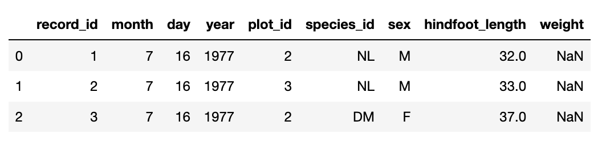

# More on Pandas DataFrames

In the last lesson, we read a CSV file into a DataFrame and
saved it to a named object. With the data in memory, we performed basic math on the data, 
calculated summary statistics, and created plots of the data. In this
lesson, we will explore ways to access different parts of the data using indexing,
slicing and subsetting.

## Create a New Jupyter Notebook

Open a new notebook for this episode. 
You can call it _04-More-Dataframes_.
Remember to start this new notebook with a
description of what it is for. You can do this 
using a _Markdown_ cell at the very beginning.

## Import Pandas and Load the Data

We will continue to use the surveys dataset that we worked with in the last
exercise. Import the DataFrame and load the CSV file:

~~~
import pandas as pd
surveys_df = pd.read_csv("surveys.csv")
~~~
{: .python}

# Indexing & Slicing in Python

We often want to work with subsets of a DataFrame object. There are
different ways to accomplish this including: using labels (column headings),
numeric ranges, or specific x,y index locations.

## Selecting Data Using Labels: Column Headings

We use square brackets `[]` to select a subset of a Python object. For example,
we can select all of data from a column named `species_id` from the `surveys_df`
DataFrame by name:

~~~
surveys_df['species_id']
~~~
{: .python}

You can also call the column as an attribute, which gives you the same output as above

~~~
surveys_df.species_id
~~~
{: .python}

~~~
0         NL
1         NL
2         DM
3         DM
4         DM
        ... 
35544     AH
35545     AH
35546     RM
35547     DO
35548    NaN
Name: species_id, Length: 35549, dtype: object
~~~
{: .output}

We can create a new object that contains the data within the `species_id`
column as a pandas Series:

~~~
surveys_species = surveys_df['species_id']
~~~
{: .python}

If we wish to view a set of columns, then
we can pass a list of column names to select columns in the
order we would like them in our subset. This is useful when we need to reorganize the data.
_NOTE:_ If a column name is not contained in the DataFrame, you will get an error.

View the species and plot number columns from the DataFrame:

~~~
surveys_df[['species_id', 'plot_id']]
~~~
{: .python}

~~~
      species_id  plot_id
0             NL        2
1             NL        3
2             DM        2
3             DM        7
4             DM        3
...          ...      ...
35544         AH       15
35545         AH       15
35546         RM       10
35547         DO        7
35548        NaN        5

[35549 rows x 2 columns]
~~~
{: .output}

The order you specify the column names is the same order they appear in the 
subset:

~~~
surveys_df[['plot_id', 'species_id']]
~~~
{: .python}

~~~
       plot_id species_id
0            2         NL
1            3         NL
2            2         DM
3            7         DM
4            3         DM
...        ...        ...
35544       15         AH
35545       15         AH
35546       10         RM
35547        7         DO
35548        5        NaN

[35549 rows x 2 columns]
~~~
{: .output}

## Extracting Range Based Subsets: Slicing Subsets of Rows

Slicing using the `[]` operator selects a set of rows and/or columns from a
DataFrame. To slice out a set of rows, you must use the following syntax:
`data_frame[start:stop]`. 

To select rows 0, 1, and 2 you specify the rows using the index ranges. Note that the 
bounds you specify require that the start bound (`0`) is included in the subset and the stop bound
(`3`) is one index greater than the last row you want to include.

~~~
surveys_df[0:3]
~~~
{: .python}

> ## Python slice syntax
> The rules of Python slice syntax are as follows and also apply to 
> lists, stings, and other sequential datatypes. The following example shows 
> this using a list.
> 
> First create a list:
> 
> ~~~
> x = ['A','B','C','D','E','F','G','H','I','J']
> x
> ~~~
> {: .python}
> 
> ~~~
> ['A', 'B', 'C', 'D', 'E', 'F', 'G', 'H', 'I', 'J']
> ~~~
> {: .output}
> 
> Print the values `A` through `E`:
> 
> ~~~
> x[0:5]
> ~~~
> {: .python}
> 
> ~~~
> ['A', 'B', 'C', 'D', 'E']
> ~~~
> {: .output}
> 
> Print the list starting at `E` through to the end:
> 
> ~~~
> x[4:]
> ~~~
> {: .python}
> 
> ~~~
> ['E', 'F', 'G', 'H', 'I', 'J']
> ~~~
> {: .output}
> 
> Print the first 4 letters in the list 
> (Note that this is the same as `x[0:4]`):
> 
> ~~~
> x[:4]
> ~~~
> {: .python}
> 
> ~~~
> ['A', 'B', 'C', 'D']
> ~~~
> {: .output}
> 
> Print the _last_ letter in the list:
> 
> ~~~
> x[-1]
> ~~~
> {: .python}
> 
> ~~~
> 'J'
> ~~~
> {: .output}
> 
> The slice syntax includes a third component called the _step_. Where 
> `x[start:stop:step]` returns the list from the `start` index for every `step` up to the index
> before `stop`. The example below prints every third letter in the list starting from `0`
> all the way to the end.
> 
> ~~~
> x[::3]
> ~~~
> {: .python}
> 
> ~~~
> ['A', 'D', 'G', 'J']
> ~~~
> {: .output}
{: .callout}

<!-- Add in R exercise here -->

> ## Slice syntax in R
>
> It is important to be aware of the different
> ways in which Python and R allow you to slice
> and subset lists. 
> Try to produce the same output as you just
> did for Python above, but this time use R.
> Start by creating the list of letters in your
> R environment (RStudio or R terminal):
>
> ~~~
> > x <- c('A','B','C','D','E','F','G','H','I','J')
> > x
> ~~~
>
> ~~~
> [1] "A" "B" "C" "D" "E" "F" "G" "H" "I" "J"
> ~~~
> {: .output}
> 
> _Remember: R begins indexing lists at 1._
> 
> > ## Solution
> >
> > With the same list:
> > `['A','B','C','D','E','F','G','H','I','J']`, 
> > Python and R will return the same output 
> > given the syntax below:
> > 
> > |Result|| Python  || R  |
> > |:---|:---:|:---|:---:|:---|
> > |Print `A` through `E`||`x[0:5]`||`x[1:5]`|
> > |Print `E` through to the end||`x[4:]`||`x[5:length(x)]`|
> > |Print the first 4 letters||`x[:4]`||`x[1:4]`|
> > |Print the last letter||`x[-1]`||`x[length(x)]`|
> > |Print every 3rd letter||`x[::3]`||`x[seq(1,length(x),3)]`|
> > 
> > If you use Python slice syntax in R, most of
> > what is in the above table will result in an 
> > error. For example if you type `x[:4]` in R,
> > you will get: 
> > ~~~
> > Error: unexpected ':' in "x[:"
> > ~~~
> > {: .output}
> > 
> > One exception is that `x[-1]` is a valid 
> > statement in R. Try doing this. 
> > **What is returned when you use a negative 
> > value in the `[]` of a list in R?**
> >
> > The other exception is that `x[0:5]` 
> > and `x[1:5]` **return the same output** in R
> > even though `x[0]` is not one of the list
> > elements! In R, the statement `x[0]` will
> > return a 0-length vector of the same type. 
> > This is ignored when you use the syntax
> > `x[0:5]`, and the elements in `1` through
> > `5` are printed. 
> {: .solution}
{: .challenge}

> ## Select a subset of rows from a column
>
> Combine selecting a subset with column headings and slice syntax for rows. Get
> every 5th row for rows 20-60, from the columns `plot_id`, `species_id`, and `sex`. 
>
> > ## Solution
> > 
> > ~~~
> > surveys_df[['plot_id', 'species_id','sex']][20:61:5]
> > ~~~
> > {: .python}
> > 
> > ~~~
> >     plot_id species_id sex
> > 20       14         DM   F
> > 25       15         DM   M
> > 30       15         DM   F
> > 35       16         OT   F
> > 40       23         DM   F
> > 45       19         DM   M
> > 50       21         DM   F
> > 55       20         DM   M
> > 60       23         DM   M
> > ~~~
> > {: .output}
> {: .solution}
{: .challenge}

## Changing Values in a DataFrame
{: #changingvals }

We can reassign values within subsets of our DataFrame. But before we do that, let's make a 
copy of our DataFrame so as not to modify our original imported data. 

~~~
surveys_copy = surveys_df
~~~
{: .python}

Now set the first three rows of data in the DataFrame to 0 for every column

~~~
surveys_copy[0:3] = 0
~~~
{: .python}

Next, print the first 6 rows of `surveys_copy` using the `.head()` method: 

~~~
surveys_copy.head(6)
~~~
{: .python}

~~~
   record_id  month  day  year  plot_id species_id sex  hindfoot_length  \
0          0      0    0     0        0          0   0              0.0   
1          0      0    0     0        0          0   0              0.0   
2          0      0    0     0        0          0   0              0.0   
3          4      7   16  1977        7         DM   M             36.0   
4          5      7   16  1977        3         DM   M             35.0   
5          6      7   16  1977        1         PF   M             14.0   

   weight  
0     0.0  
1     0.0  
2     0.0  
3     NaN  
4     NaN  
5     NaN  
~~~
{: .output}

Now print the first 6 rows of `surveys_df`

~~~
surveys_df.head(6)
~~~
{: .python}

What is the difference between the two data frames? Did `surveys_copy = surveys_df` make a 
proper copy of the DataFrame?

## Referencing Objects vs. Copying Objects in Python

We might have thought that we were creating a fresh copy of the `surveys_df` values when we 
used `surveys_copy = surveys_df`. However, for objects of certain datatypes (like lists and 
DataFrames) the assignment operator (`=`) only copies by reference. 
That is, it creates a new variable name "`surveys_copy`" binds it to the **same** 
object `surveys_df` refers to. 
This means that there is only one object 
(the DataFrame), and both `surveys_df` and `surveys_copy` refer to it. So when we assign 
the first 3 rows 
the value of 0 using the 
`surveys_copy` DataFrame, the `surveys_df` DataFrame is modified too. 

To create a fresh, _duplicate_ 
copy of the `surveys_df`
DataFrame we use the syntax `surveys_copy = surveys_df.copy()`. 
But first we have to read the `surveys_df` again 
because the current version contains the unintentional changes made to the first 3 rows.

~~~
surveys_df = pd.read_csv("surveys.csv")
surveys_copy= surveys_df.copy()
~~~
{: .python}

Now reassign the first three rows to have the value `0` for all columns:

~~~
surveys_copy[0:3] = 0
~~~
{: .python}

Print the first 5 rows of both DataFrames:

~~~
surveys_copy.head(5)
~~~
{: .python}

~~~
surveys_df.head(5)
~~~
{: .python}

Did both DataFrames get altered this time?

<!-- 
> ## Deep vs. Shallow Copy in Python
> 
> The way that the Pandas `DataFrame.copy()` 
> method works is kind of confusing if you 
> are familiar with Python. In Pandas, 
> this method creates a _deep_ copy of the 
> DataFrame. That is because there is an 
> argument of the function that is by default:
> `deep=True`. 
>
> This is counter to how the `.copy()` method
> works in Python. 
>
{: .callout}
 -->
<!-- I am thinking that this distinction
about deep vs shallow copy in Python
is too confusing to go into. That's 
because list.copy() does make a deep copy
and I can't find a good example of where
this will be an issue. -->

## Slicing Subsets of Rows and Columns

We can select specific ranges of our data in 
both the row and column directions
using either label or integer-based indexing.

- `iloc`: indexing via *integer indices*
- `loc`: indexing via *labels* 

To select a subset of rows AND columns from our DataFrame, we can use the `.iloc[]`
index. For example, we can select month, day and year (columns 2, 3 and 4 if we
start counting at 1) for the first 3 rows in the DataFrame, like this:

~~~
surveys_df.iloc[0:3, 1:4]
~~~
{: .python}

~~~
   month  day  year
0      7   16  1977
1      7   16  1977
2      7   16  1977
~~~
{: .output}

Notice that we asked for a slice from 0:3. This yielded 3 rows of data. When you
ask for 0:3, you are actually telling python to start at index 0 and select rows
0, 1, 2 **up to but not including 3**.

Alternatively, `.loc[]` requires that you use labels to access the rows (row labels are their integer indices) and columns (column names). 

Here we can access the `species_id` for row number `5`:

~~~
surveys_df.loc[5, 'species_id']
~~~
{: .python}

~~~
'PF'
~~~
{: .output}

If we want to use `.iloc[]` to access that same cell we would use:

~~~
surveys_df.iloc[5, 5]
~~~
{: .python}

~~~
'PF'
~~~
{: .output}

Thus there are many different ways to access our DataFrame. Here's another example: we can select all the columns for rows with index labels `0` and `10`:

~~~
surveys_df.loc[[0, 10], :]
~~~
{: .python}

~~~
    record_id  month  day  year  plot_id species_id sex  hindfoot_length  \
0           1      7   16  1977        2         NL   M             32.0   
10         11      7   16  1977        5         DS   F             53.0   

    weight  
0      NaN  
10     NaN  
~~~
{: .output}

Or we can just view the `species_id`, `plot_id`, and `weight` of observation `777`:

~~~
surveys_df.loc[777, ['species_id', 'plot_id', 'weight']]
~~~
{: .python}

~~~
species_id    DM
plot_id        8
weight        36
Name: 777, dtype: object
~~~
{: .output}

NOTE: Labels must be found in the DataFrame or you will get a `KeyError`. The
start bound and the stop bound are _included_ when using `.loc[]` to access rows, integer indices
because they refer to the index label and not the position. Thus
when you use `.loc[]`, and select `1:4`, you will get a different result than using
`.iloc[]` to select rows `1:4`.

Here we use `.iloc[]` to get the first 2 columns for rows 1, 2, and 3:

~~~
surveys_df.iloc[1:4, :2]
~~~
{: .python}

~~~
   record_id  month
1          2      7
2          3      7
3          4      7
~~~
{: .output}

If we use `.loc[]` to select `1:4`, then this will include all of the elements with the specified labels:

~~~
surveys_df.loc[1:4, ['record_id','month']]
~~~
{: .python}

~~~
   record_id  month
1          2      7
2          3      7
3          4      7
4          5      7
~~~
{: .output}

> ## Access specific values using `.loc[]` and `.iloc[]`
>
> 1. Use `.loc[]` to view the `species_id` and `sex` of the animals observed in
> row 1, 3, and 5
> 
> 2. Use `.iloc[]` to view the same thing.
>
> > ## Solution
> > 
> > ~~~
> > # 1
> > surveys_df.loc[[1, 3, 5], ['species_id','sex']]
> > 
> > # 2
> > surveys_df.iloc[1:6:2, [5,6]]
> > ~~~
> > {: .python}
> {: .solution}
{: .challenge}

## Subsetting Data using Criteria

We can also select a subset of our data using specific criteria. For example, we can
select all rows that have a year value of 2002.

~~~
surveys_df[surveys_df.year == 2002]
~~~
{: .python}

~~~
record_id  month  day  year  plot_id species_id  sex  hindfoot_length  weight
33320      33321      1   12  2002        1         DM    M     38      44 
33321      33322      1   12  2002        1         DO    M     37      58
33322      33323      1   12  2002        1         PB    M     28      45
33323      33324      1   12  2002        1         AB  NaN    NaN     NaN
33324      33325      1   12  2002        1         DO    M     35      29
...
35544      35545     12   31  2002       15         AH  NaN    NaN     NaN
35545      35546     12   31  2002       15         AH  NaN    NaN     NaN
35546      35547     12   31  2002       10         RM    F     15      14
35547      35548     12   31  2002        7         DO    M     36      51
35548      35549     12   31  2002        5        NaN  NaN    NaN     NaN

[2229 rows x 9 columns]
~~~
{: .output}

Or we can select all rows that do not contain the year 2002.

~~~
surveys_df[surveys_df.year != 2002]
~~~
{: .python}

We can define sets of criteria too:

~~~
surveys_df[(surveys_df.sex == 'M') & (surveys_df.year <= 1985)]
~~~
{: .python}

> ## Records by weight and year
>
> Select a subset of rows in the `surveys_df` DataFrame that contain data from
> the year 1999 and that contain weight values less than or equal to 8. How
> many rows did you end up with?
>
> > ## Solution
> > 
> > ~~~
> > surveys_df[(surveys_df.weight <= 8.0) & (surveys_df.year == 1999)]
> > ~~~
> > {: .python}
> > ~~~
> >        record_id  month  day  year  plot_id species_id sex  hindfoot_length  \
> > 29082      29083      1   16  1999       21         RM   M             16.0   
> > 29196      29197      2   20  1999       18         RM   M             18.0   
> > 29421      29422      3   15  1999       16         RM   M             15.0   
> > 29903      29904     10   10  1999        4         PP   M             20.0   
> > 29905      29906     10   10  1999        4         PP   M             21.0   
> > 
> >        weight  
> > 29082     8.0  
> > 29196     8.0  
> > 29421     8.0  
> > 29903     7.0  
> > 29905     4.0  
> > ~~~
> > {: .output}
> {: .solution}
{: .challenge}

## Iterating Over a DataFrame

To iterate over a data frame using a loop, we
can access the row and its index using the 
`.iterrows()` method. First, create a variable 
that just contains the data for observations of 
the species [_Onychomys torridus_](https://en.wikipedia.org/wiki/Southern_grasshopper_mouse). 

~~~
surveys_OT = surveys_df[surveys_df.species_id == 'OT']  
~~~
{: .python}

Let's say that we want to calculate the average hind foot length. 
With this subset DataFrame, we can iterate over the rows and calculate the sum of the hind foot length and count the number of observations we have (remember that we might not have gotten that measurement for every observation).

~~~
sum_hfl = 0.0
count = 0
for index, row in surveys_OT.iterrows():
    hfl = row['hindfoot_length']
    if(pd.isna(hfl) is False): 
        sum_hfl += hfl
        count += 1
~~~
{: .python}

The Pandas method `.iterrows()` returns the index of the row and the row as a Pandas series object.
This allows us to access the column values easily.
We use the Pandas function `pd.isna()` to check if the row has a value for `hindfoot_length`. If that cell is empty, it is not factored into the calculation of the average.

Now we can compute the average hind-foot length:

~~~
ave_OT_hfl = sum_hfl / count
print(ave_OT_hfl)
~~~
{: .python}

Let's compare this value to the one calculated by Pandas:

~~~
print(surveys_OT.hindfoot_length.mean())
~~~
{: .python}

## Adding a New Column to a DataFrame

Perhaps we want to add a value, notation, or other information to our DataFrame. This is easily done by just initializing the value. 
We will do this for our copy of the DataFrame, for only the observations made in the year 2000.

~~~
surveys_2000 = surveys_df[surveys_df.year == 2000].copy()
~~~
{: .python}

Now we can iterate over the rows in our new DataFrame, compute the value and add it to the DataFrame in the column `'new_value'`.

~~~
for index, row in surveys_2000.iterrows():
    hfl = row['hindfoot_length']
    weight = row['weight']
    if(pd.isna(hfl) is False and pd.isna(weight) is False): 
        surveys_2000.loc[index,'new_value'] = hfl / weight
~~~
{: .python}

View the summary of this new column:

~~~
surveys_2000.new_value.describe()
~~~
{: .python}

