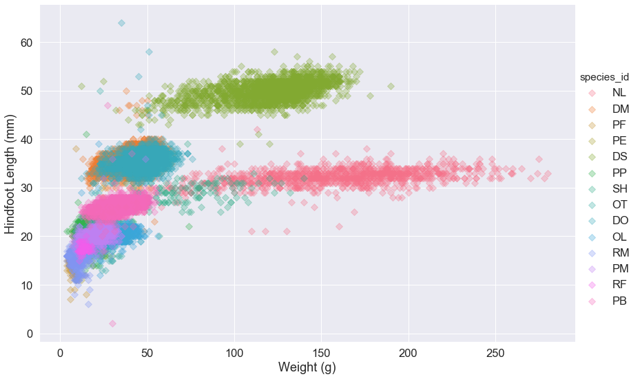
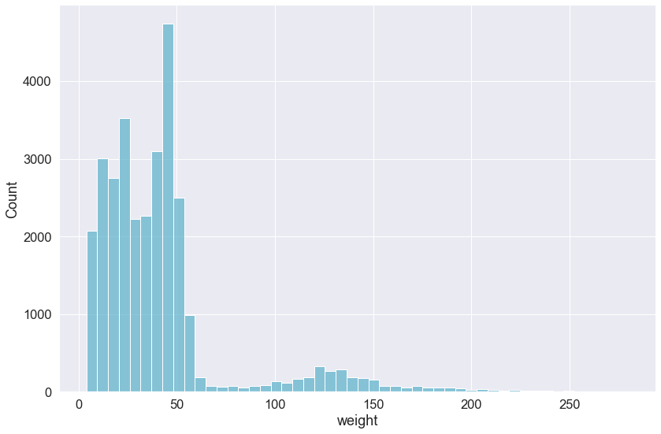
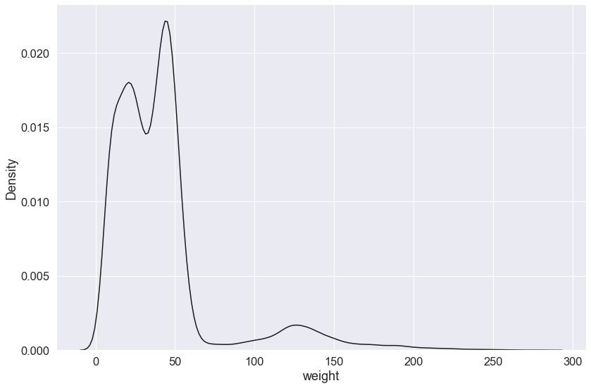

Visualization is meant to convey information.

> The power of a graph is its ability to enable one to take in the quantitative information, organize it, and see patterns and structure not readily revealed by other means of studying the data.
>
> - Cleveland and McGill, 1984

# Plotting with `matplotlib`

Now, we'll start learning how to create visualizations in Python. We'll start by using a popular python package called matplotlib, and later on use a second package called seaborn that builds on matplotlib First we'll import matplotlib, along with several other Python packages.

~~~
import math
import random
import numpy as np
import pandas as pd
import matplotlib as mpl
import matplotlib.pyplot as plt
~~~
{: .python}

One of the nice features of Jupyter notebooks is that figures can be plotted inline, which means they appear below the code cell that creates them. This is not the default behavior however, and so we'll use the below "Magic" statement to tell the Jupyter notebook to plot the figures inline (instead of opening a separate browser window to show them).

~~~
%matplotlib inline
~~~
{: .python}

To illustrate what matplotlib can do, we'll need to use a dataset. We've decided to use the so-called Gapminder dataset, which was compiled by Jennifer Bryan. This dataset contains several key demographic and economic statistics for many countries, across many years. For more information, see the gapminder repository.

We'll use the pandas Python package to load the .csv (comma separated values) file that contains the dataset. The pandas package provides DataFrame objects that organize datasets in tabular form (think Microsoft Excel spreedsheets). We've created an alias for the pandas package, called pd, which is the convention. To read in a .csv file we simply use `pd.read_csv`. This .csv file happens to be tab-delimited, so we need to specify `sep=\t`.

~~~
df = pd.read_csv('data/gapminder.tsv', sep='\t')
~~~
{: .python}


To look at the first few rows of the dataset we'll use the `.head()` method of the dataframe.

~~~
df.head()
~~~
{: .python}

~~~
   population  fertility  ...  child_mortality                      Region
0  34811059.0       2.73  ...             29.5  Middle East & North Africa
1  19842251.0       6.43  ...            192.0          Sub-Saharan Africa
2  40381860.0       2.24  ...             15.4                     America
3   2975029.0       1.40  ...             20.0       Europe & Central Asia
4  21370348.0       1.96  ...              5.2         East Asia & Pacific

[5 rows x 10 columns]
~~~
{: .output}

It looks like we have information about life expectancy (lifeExp), population (pop) and per-capita GDP (gdpPercap), across multiple years per country.

To start off, let's say we want to explore the data from the most recent year in the dataset. 

~~~
latest_year = df['year'].max()
latest_year
~~~
{: .python}

~~~
2007
~~~
{: .output}

~~~
df_latest = df[df['year']==latest_year]
df_latest.shape
~~~
{: .python}

~~~
(142, 6)
~~~
{: .output}

Ok, looks like we have 142 values, or rows, across our 6 variables, or columns. Let's get an idea of how per-capita GDP was distributed across all of the countries during 2007 by calculating some summary statistics. We'll do that using the DataFrame's `.describe()` method.

~~~
df_latest['gdpPercap'].describe()
~~~
{: .python}

~~~
count      142.000000
mean     11680.071820
std      12859.937337
min        277.551859
25%       1624.842248
50%       6124.371109
75%      18008.835640
max      49357.190170
Name: gdpPercap, dtype: float64
~~~
{: .output}

Across 142 countries the mean GDP was ~$11680, and the standard deviation was ~$12860! There was a lot of deviation in GDP across countries, but these summary statistics don't give us the whole picture. To get the whole picture, let's draw a picture! Or plot a figure more accurately.

## Histograms

Histograms plot an discretized distribution of a one-dimensional dataset across all the values it has taken. They visualize how the many data points are in each of  bins, each of which has a pre-defined range.

To create a histogram plot in matplotlib we'll use pyplot, which is a collection of command style functions that make matplotlib work like MATLAB and save many lines of repeated code. By convention, pyplot is aliased to plt, which we've alread done in the above import cell.

Let's use `plt.hist()` to create a histogram of the per-capita GDP in 2007.

~~~
plt.hist(df_latest['gdpPercap']);
~~~
{: .python}


Protip: Use a semicolon (;) at the end of the last line in a Jupyter notebook cell to suppress the notebooks from printing the return value of the last line. This was done in the above cell. Try removing the ; to see how the output changes.

This histogram tells us that many of the countries had a low GDP, which was less than 5,000. There is also a second "bump" in the histrogram around 30,000. This type of distribution is known as bi-modal, since there are two modes, or common values.

To make this histogram more interpretable let's add a title and labels for the  and  axes. We'll pass strings to `plt.title()`, plt.xlabel(), and `plt.ylabel()` to do so.


~~~
plt.hist(df_latest['gdpPercap']);
plt.title('Distribution of Global Per-Capita GDP in 2007')
plt.xlabel('Per-Capita GDP (Millions of USD)')
plt.ylabel('# of Countries');
~~~
{: .python}


Each line in the histogram represents a bin. The height of the line represents the number of items (countries in this case) within the range of values spanned by the bin. In the last plots we used the default number of bins (10), now let's use more bins by specifying the bin=20 parameter.

~~~
plt.hist(df_latest['gdpPercap'], bins=30);
plt.title('Distribution of Global Per-Capita GDP in 2007')
plt.xlabel('Per-Capita GDP (Millions of USD)')
plt.ylabel('# of Countries');
~~~
{: .python}


We can see this histogram doesn't look as "smooth" as the last one. There's no "right" way to display a histogram, but some bin counts definitely are more informative than others. For example, using only 3 bins we cannot see the bi-modal nature of the GDP distribution

~~~
plt.hist(df_latest['gdpPercap'], bins=3);
plt.title('Distribution of Global Per-Capita GDP in 2007')
plt.xlabel('Per-Capita GDP (Millions of USD)')
plt.ylabel('# of Countries');
~~~
{: .python}


The styling that you see in the plot above are the matplotlib defaults. For now, we'll continue to use those defaults as the first portion of this workshop is geared toward getting you familiar with the API-how to actually create the plots you're interested in. Then, we'll cover how to customize plot styles in a later section.)


As you can see, we can call functions in the plt module multiple times within a single cell and those functions will all work on, and modify, the current figure associated with the current cell. This is because `pyplot` (or `plt`) keeps an internal variable for the current figure which is unique to each cell plt is used in.

NOTE Unless specified in the help function, the order of these function calls doesn't matter. See that the cell below produces the same plot as the one above even though the calls to `plt` functions are in a different order.

~~~
import numpy as np
import seaborn as sns
import matplotlib.pyplot as plt
import statsmodels.api as sm

# Generate some random data for demonstration
#data = np.random.normal(loc=0, scale=1, size=1000)
data =df_latest['gdpPercap']

# Create subplots
fig, axs = plt.subplots(1, 3, figsize=(18, 6))  # Adjusted figsize for better display

# Plot box plot
axs[0].boxplot(data, vert=False)
axs[0].set_title('Box Plot')

# Plot histogram with KDE
sns.histplot(data, kde=True, color='skyblue', ax=axs[1])
axs[1].set_title('Histogram with Density Plot')

# Plot Q-Q plot
sm.qqplot(data, line='45', ax=axs[2])
axs[2].set_title('Q-Q Plot')

plt.tight_layout()
plt.show()
~~~
{: .python}

The above  code aims to provide a visual representation of the distribution and quantiles of the data using different types of plots for analysis and visualization. It is attempting to visualize a dataset using three different types of plots: a box plot, a histogram with kernel density estimation (KDE), and a Q-Q (quantile-quantile) plot.


these plots collectively provide insights into the distributional characteristics, presence of outliers, and conformity to theoretical distributions of the dataset. They are valuable tools for exploratory data analysis, helping researchers and analysts understand the underlying structure and patterns within the data.


## Bar Plots

Next, it might be interesting to get a sense of how many countries per continent we have data for. Let's create a country DataFrame that includes only the unique combinations of country and continent by dropping all duplicate rows using drop_duplicates()

~~~
countries = df[['country', 'continent']]
countries = countries.drop_duplicates()
countries
~~~
{: .python}

~~~
                 country continent
0            Afghanistan      Asia
12               Albania    Europe
24               Algeria    Africa
36                Angola    Africa
48             Argentina  Americas
...                  ...       ...
1644             Vietnam      Asia
1656  West Bank and Gaza      Asia
1668         Yemen, Rep.      Asia
1680              Zambia    Africa
1692            Zimbabwe    Africa

[142 rows x 2 columns]

~~~
{: .output}

To get the number of countries per continent we'll use the .groupby() method to group by continent, then count the unique countries in each continent. We'll use the as_index=False argument so that the contininent name gets it's own column, and is not used as the index. This will create a new DataFrame that we'll call country_counts.

~~~
country_counts = countries.groupby('continent', as_index=False)['country'].count()
country_counts
~~~
{: .python}

~~~
  continent  country
0    Africa       52
1  Americas       25
2      Asia       33
3    Europe       30
4   Oceania        2
~~~
{: .output}

## Continouous data plot

A quick way to analyze the distribution of numerical columns in a DataFrame is to calculate summary statistics (skewness and kurtosis), creates histograms to visualize the distribution, uses box plots to identify outliers, and generates normal probability plots to assess normality. This information can be useful for understanding the characteristics of the data and determining appropriate statistical methods for further analysis. 

~~~
from scipy.stats import probplot
import numpy as np
import pandas as pd
import matplotlib.pyplot as plt
import seaborn as sns

# Set use_inf_as_na to True to handle infinite values
pd.set_option('mode.use_inf_as_na', True)

# Assuming df is your DataFrame
for col in df.select_dtypes(np.number).columns:
    plt.figure(figsize=(14, 4))
    print(f"Skewness of {col}:", df[col].skew())
    print(f"Kurtosis of {col}:", df[col].kurtosis())
    
    plt.subplot(131)
    sns.histplot(df[col], kde=True)
    plt.subplot(132)
    sns.boxplot(data=df, x=col)
    plt.subplot(133)
    probplot(df[col], dist='norm', rvalue=True, plot=plt)
    
    plt.suptitle(col)
    plt.show()
~~~
{: .python}


### categorical data plot 

A count plot, also known as a bar plot, is a type of plot that displays the count or frequency of each category in a categorical variable. In this case, the 'continent' column is a categorical variable, and the count plot shows the number of occurrences for each continent in the DataFrame

~~~
import matplotlib.pyplot as plt
import seaborn as sns
import gc
plt.figure(figsize=(10,6))
sns.countplot(data=df, x='continent')
plt.xticks(rotation=90)
plt.show()
plt.close('all')
gc.collect()
~~~
{: .Python}


~~~
import gc
df_africa = df[df.continent =='Africa']
plt.figure(figsize=(10,6))
sns.countplot(data=df_africa, x='country')
plt.xticks(rotation=90)
plt.gca().invert_yaxis()
plt.gca().invert_xaxis() 
plt.show()
plt.close('all')
gc.collect()
~~~


### HeatMap

A heatmap is a graphical representation of data where the individual values contained in a matrix are represented as colors. It is a powerful tool for visualizing and analyzing complex data, especially when dealing with large datasets. The  heatmap provides a visual representation of the correlations between numerical columns in the DataFrame, helping to identify relationships and patterns in the data.

~~~
import matplotlib.pyplot as plt
import seaborn as sns
import gc

# Filter out only the numerical columns
numerical_df = df.select_dtypes(include=['float64', 'int64'])

# Drop NaN values along columns in the numerical DataFrame
numerical_df = numerical_df.dropna(axis=1)

plt.figure(figsize=(12, 8))
fig = sns.heatmap(numerical_df.corr(), annot=True, cmap='rainbow', vmin=-1.0, vmax=1.0)
plt.xticks(rotation=90)
plt.show()
plt.close('all')
gc.collect()
~~~
{: .Python}


# Plotting with `seaborn`

Python has powerful built-in plotting capabilities and
for this exercise, we will focus on using the [`seaborn`](https://seaborn.pydata.org/)
package, which facilitates the creation of highly-informative plots of
structured data.
The `seaborn` library is built on `matplotlib` and features very nice color palettes. This library makes manipulating the features of a `matplotlib` plot somewhat easier. For an introduction to this package, see the [`seaborn` documentation](https://seaborn.pydata.org/introduction.html).


## Getting Started

Create a new Jupyter notebook for this lesson and
begin by importing the Pandas package and seaborn. We also need to import the matplotlib plotting functions `pyplot` in order to directly call any of the plotting functions for matplotlib

~~~
import pandas as pd
import matplotlib.pyplot as plt
import seaborn as sns
~~~
{: .python}

Here, we have given seaborn the alias `sns`. 

<!-- Also, remember that you need to include an inline command if you're using a Jupyter notebook or IPython in spyder:

~~~
%matplotlib inline
~~~
{: .python} -->

Now load the DataFrame:

~~~
surveys_complete = pd.read_csv('surveys_complete.csv', index_col=0)
~~~
{: .python}

For this exercise, we will use a different version of the ecological dataset from our previous lessons. This version has only the complete observations, without missing entries for any of the columns. There are also a few additional columns providing information about the taxonomy of the species collected and the type of plot/enclosure. 

## A Simple Scatterplot

Let's start with a basic scatterplot. We'll simply plot the weight on the horizontal axis and the hind foot length on the vertical axis. This uses the seaborn function `.lmplot()`. This function can take a Pandas DataFrame directly. It also will fit a regression line, by default. Since we may not want to visualize these data with a regression line, we will use the `fit_reg=False` argument.

~~~
sns.lmplot(x="weight", y="hindfoot_length", data=surveys_complete, fit_reg=False)
~~~
{: .python}


Out of the box, seaborn will plot with a given set of aesthetics. We may want to change the label font size and make the background gray. For this, we can call the `.set()` method. If this method is called without any arguments, `sns.set()`, this will switch on the seaborn defaults, which changes the background color to gray and overlays white grid lines (i.e., a similar background to ggplot2 in R). We can add an argument to also change the font size for all of our downstream figures:

~~~
sns.set(font_scale=1.5)
~~~
{: .python}

This will increase the font size of the labels by 50% in all of our subsequent plots.

~~~
sns.lmplot(x="weight", y="hindfoot_length", data=surveys_complete, fit_reg=False)
~~~
{: .python}


The plot size is small, by default, and with seaborn, there isn't a way to change the size of every plot with a single function. Further, this is done differently depending on the plot function we use because some functions return matplotlib objects and others are drawn using a grid object. 

For `.lmplot()`, we can set the plot size directly as arguments in the function call using the `size` and `aspect` arguments. These arguments control the height and width of the object, respectively.  

~~~
sns.lmplot(x="weight", y="hindfoot_length", data=surveys_complete, fit_reg=False, height=8, aspect=1.5)
~~~
{: .python}


### Changing marker aesthetics

One issue with this plot is that because we have a large dataset, it is difficult to adequately visualize the points on our graph. This is called "[overplotting](https://python-graph-gallery.com/134-how-to-avoid-overplotting-with-python/)". One way to avoid this is to change the size of the marker. Here we use the argument `scatter_kws` that takes a _dictionary_ of keywords and values that are passed to the matplotlib `scatter` function.

~~~
sns.lmplot(x="weight", y="hindfoot_length", data=surveys_complete, fit_reg=False, height=8, aspect=1.5, scatter_kws={"s": 5})
~~~
{: .python}


Alternatively, we can change the marker type using the `markers` keyword argument. By default, `lmplot()` sets `markers='8'`. If we want to change the marker, we must use the correct [matplotlib code](https://matplotlib.org/examples/lines_bars_and_markers/marker_reference.html). Let's change the markers to X-es:

~~~
sns.lmplot(x="weight", y="hindfoot_length", data=surveys_complete, fit_reg=False, height=8, aspect=1.5, markers='x')
~~~
{: .python}


Another way to avoid overplotting is to use transparency so that regions of the plot with many points are darker. This is achieved using the `scatter_kws` argument and setting the alpha value. (This is using [alpha compositing](https://en.wikipedia.org/wiki/Alpha_compositing).)

~~~
sns.lmplot(x="weight", y="hindfoot_length", data=surveys_complete, fit_reg=False, height=8, aspect=1.5, scatter_kws={'alpha':0.3})
~~~
{: .python}


### Coloring markers by a categorical value

We can also specify that the `species_id` labels indicate categories that determine a point's color:

~~~
sns.lmplot(x="weight", y="hindfoot_length", data=surveys_complete, 
           fit_reg=False, height=8, aspect=1.5, scatter_kws={'alpha':0.3,"s": 50}, 
           hue='species_id', markers='D')
~~~
{: .python}


### Setting the axis labels

There are different ways to set figure properties using seaborn. For `.lmplot()`, we can create a figure variable and use a member method of that variable to set the axis labels. 

~~~
my_fig = sns.lmplot(x="weight", y="hindfoot_length", data=surveys_complete, 
                    fit_reg=False, height=8, aspect=1.5, 
                    scatter_kws={'alpha':0.3,"s": 50}, 
                    hue='species_id', markers='D')
my_fig.set_axis_labels('Weight (g)', 'Hindfoot Length (mm)')
~~~
{: .python}




> ## Scatter plot for a single plot
>
> How would you plot the hind foot length and weight for just a single plot?
> Remember how to access subsets of a DataFrame based on conditional criteria?
> Plot the scatter plot above for only plot number `12` and color by `sex`. (Make the markers larger circles.)
>
> > ## Solution
> > 
> > ~~~
> > my_fig = sns.lmplot(x="weight", y="hindfoot_length", 
                    data=surveys_complete[surveys_complete.plot_id == 12], 
                    fit_reg=False, height=8, aspect=1.5, 
                    scatter_kws={'alpha':0.3,"s": 200}, 
                    hue='sex', markers='8')
my_fig.set_axis_labels('Weight (g)', 'Hindfoot Length (mm)')
> > ~~~
> > {: .python}
> > 
> > 
> {: .solution}
{: .challenge}


# Box Plots & Violin Plots

We often like to compare the distributions of values across different categorical variables. Box plots and violin plots are often used to do this in a simple way. 

In seaborn, both the `.boxplot()` and `.violinplot()` functions return matplotlib Axes objects. Thus, these plot functions do not have arguments for `height` and `aspect` like the scatter plot function above. 

In order to change the size of these plots, we must create a matplotlib figure and axes and set the dimensions of the figure. First, let's decide on the figure size we will use for the rest of our seaborn plots.

We can put these dimensions into a tuple variable called `plot_dims`.

~~~
plot_dims = (14, 9)
~~~
{: .python}

Now, every time we create a new plot that returns a matplotlib Axes object, we can call the `.subplots()` function to change some of the aesthetics. Because of the iteritve way in which figures are built using matplotlib, we need to always execute our creation of the figure and the plot function in a single notebook cell. 

~~~
fig, ax = plt.subplots(figsize=plot_dims)
sns.boxplot(x='species_id', y='hindfoot_length', data=surveys_complete)
ax.set(xlabel='Species ID', ylabel='Hindfoot Length (mm)')
~~~
{: .python}


Note that for the `.boxplot()` function, we can simply set the x and y values by giving the column names from our DataFrame. Then we must use the `data=surveys_complete` argument to indicate our DataFrame object.

Now let's use a violin plot to visualize the weight data. For these data, we would also like the weight to be on the log10 scale. We will make this plot horizontal, so we'll set the horizontal axis to be on the log scale. 
An easy way to do this is to create a new graph variable from our `.violinplot()` function and then call the `.set_xscale()` that is a member method of the graph variable.

~~~
fig, ax = plt.subplots(figsize=plot_dims)
g = sns.violinplot(x='weight', y='species_id', data=surveys_complete, 
                   linewidth=0.2, orient="h", cut=0)
g.set_xscale('log', base=10)
ax.set(ylabel='Species ID', xlabel='Weight (g)')
~~~
{: .python}


> ## Violin plot for a single species
>
> Use seaborn to make a violin plot comparing the relative distributions of weight 
> measurements for different sexed animals from a single 
> species, [*Onychomys leucogaster* (OL)](https://en.wikipedia.org/wiki/Northern_grasshopper_mouse), one of the coolest rodent species:
>
> > ## Solution
> > 
> > ~~~
> > fig, ax = plt.subplots(figsize=plot_dims)
sns.violinplot(x='sex', y='weight', data=surveys_complete[surveys_complete.species_id == 'OL'])
> > ~~~
> > {: .python}
> > 
> > 
> {: .solution}
{: .challenge}

# Histograms

Often, a histogram is a better way to visualize a distribution. This is relatively simple using seaborn's `.displot()` function. This function does not take a Pandas DataFrame, but can take a Pandas Series (i.e., column in our DataFrame). This function also can take come other arguments like `color`, which takes values that specify the color of histogram based on [matplotlib's colors](https://matplotlib.org/api/colors_api.html). We will make our plot cyan using the `'c'` color code. Additionally, we will specify `bins=50` so that our histogram is not plotted using too many or too few bins.

~~~
sns.displot(surveys_complete['weight'], color='c',bins=50, 
            height=8, aspect=1.5)
~~~
{: .python}



By default, the `.displot()` function plots the density as a histogram, alternatively, you can plot a kernel density estimate by setting the `kind` argument to `kind="kde"` (the default is `kind="hist"`) and removing the `bins` argument.

~~~
sns.displot(surveys_complete['weight'], color='k', kind="kde", 
            height=8, aspect=1.5)
~~~
{: .python}




# Plotting with `bokeh`

Another library called `bokeh` can create amazing, interactive graphics using D3.js (javascript). This package is also easy to install with `conda`:

```
$ conda install bokeh
```

Return to your Jupyter notebook and import the necessary bokeh plotting tools:

~~~
from bokeh.plotting import figure 
from bokeh.io import output_notebook, show
~~~
{: .python}

Here we are importing functions to create a figure and to output that figure to our Jupyter notebook.

We can now execute the `output_notebook()` function that will ensure that our Javascript images are displayed in our html notebook.

~~~
output_notebook()
~~~
{: .python}


This figure also uses the histogram function from numpy. So we have to first import that package:

~~~
import numpy as np
~~~
{: .python}

We can reproduce the histogram of the weights of all our observations.

~~~
hist, edges = np.histogram(surveys_complete['weight'], density=True, bins=100)
my_fig = figure(title="Weight (g)",background_fill_color="#EBC8EB")
my_fig.quad(top=hist, bottom=0, left=edges[:-1], right=edges[1:],fill_color="#036564", line_color="#033649")
show(my_fig)
~~~
{: .python}



We can also save this file as an html file that we can share with others or embed in files on the web. To do this, we need to include some other bokeh functions:

~~~
from bokeh.resources import CDN
from bokeh.embed import file_html
~~~
{: .python}

And create an html object and save it to a file using standard Python file i/o:

~~~
html = file_html(my_fig, CDN, "Weight Histogram")
out = open('weight_hist_bokeh.html','w')
out.write(html)
out.close()
~~~
{: .python}

If you open the file you created in your web browser, you now have an interactive version of your figure. You can then use this to embed in a website.

> ## Take-Home Challenge: More Visualizations in Python
>
> Continue to use `seaborn` and `bokeh` to try out different visualizations. 
>
> 1. Produce a histogram of the hindfoot length for only the species observed in the genus _Peromyscus_. Note that this particular dataset includes a column called `"genus"`. So you can subset out only the entries for _Peromyscus_ individuals. Try making the histogram using both `seaborn` and `bokeh`. Consider altering the bin numbers to help visualize the distribution. 
>
> 2. This dataset also has a column called `"plot_type"`. That says what kind of plot in which the animal was captured. The different plot types are specific experimental set-ups for this kind of study. Create a visualization that helps us better understand how the species (`"species_id"`) might be influenced by the plot type. For example, are some species prevented from entering certain plot types? 
>
> > ## Solutions
> >
> > The solutions will be posted in 4 days. Feel free to use the `#scripting_help` channel in Slack to discuss these exercises. 
> {: .solution}
{: .challenge}

<!-- ## Comparing densities in bokeh using ridgeline plots

A cool way of visualizing multiple histograms is to use what is called a "ridgeline" plot. There is a nice package in R called [`ggridges`](https://github.com/clauswilke/ggridges) that allows you to create these plot. Here is the additional code needed to make this plot using bokeh in Python. (To get this to work, you must first install the package `colorcet` using: `conda install colorcet`.)

~~~
from numpy import linspace
from scipy.stats.kde import gaussian_kde
import colorcet as cc

def ridge(category, data, scale=20):
    return list(zip([category]*len(data), scale*data))

cats = list(pd.unique(surveys_complete['species_id']))
palette = [cc.rainbow[i * 15] for i in range(len(cats))]
ridgeline = figure(y_range=cats, plot_width=900, x_range=(-5, 300))
x = linspace(-20,500, 500)
for i, cat in enumerate(reversed(cats)):
    pdf = gaussian_kde(surveys_complete[surveys_complete.species_id==cat]['weight'])
    y = ridge(cat, pdf(x))
    ridgeline.patch(x, y, color=palette[i], alpha=0.6, line_color="black")

ridgeline.outline_line_color = None
ridgeline.background_fill_color = "#efefef"
ridgeline.y_range.range_padding = 0.32
ridge_html = file_html(ridgeline, CDN, "ridges")
out = open('weight_ridgeline_bokeh.html','w')
out.write(ridge_html)
out.close()
show(ridgeline)
~~~
{: .python}


 -->


<!-- 
The points plotted show the spread of measurements. However, you will notice that box plots do not allow you to really visualize the relative distributions of your data. Thus, if you had some species that had strongly bimodal hind-foot length distributions, that would not be captured here. 

Violin plots provide a visual representation of the *shape* of a distribution. Compare the `weight` measurements of each species using violin plots on a log scale:

~~~
ggplot( aes(x = 'species_id', y = 'weight'), data = surveys_complete) + geom_violin() + scale_y_log(base=10)
~~~
{: .python}


# Histograms

Often, a histogram is a better way to visualize a distribution. Plotting histograms is easy with `ggplot` using `geom_histogram()`:

~~~
ggplot(aes(x = 'weight'), data=surveys_complete) + geom_histogram(binwidth=2)
~~~
{: .python}


You can change the fill of the bars to be colored according to the `species_id`, to compare the weight distributions among species:

~~~
ggplot(aes(x = 'weight', fill='species_id'), data=surveys_complete) + geom_histogram(binwidth=2)
~~~
{: .python}


# Other Plotting Tools in Python

Ultimately, the functionality of `ggplot` in Python is not quite as rich as it is for `ggplot2` in R. This is partly because Python offers many other tools for complex visualization including `matplotlib`, [`seaborn`](https://seaborn.pydata.org/), and [`bokeh`](http://bokeh.pydata.org/en/latest/). 

For example, `seaborn` is a very nice library built on `matplotlib` that also features very nice color palettes. To install this package you need to use `conda` in your **Unix** terminal (not in Python):

```
$ conda install seaborn
```

Now, `seaborn` can be used to make very nice violin plots comparing the relative distributions of weight measurements for different sexed animals from a single species, *Onychomys leucogaster*:

~~~
import seaborn as sns
ax = sns.violinplot(x = 'sex', y = 'weight', data=surveys_complete[surveys_complete.species_id == 'OL'], palette="Set2")
~~~
{: .python}


Another library called `bokeh` can create amazing, interactive graphics using D3.js (javascript). This package is also easy to install with `conda`:

```
$ conda install bokeh
```

We will use this to view histograms of the male and female weights observed for *Onychomys leucogaster*.
First, load the package and options for inline notebook output and the components for a histogram:

~~~
from bokeh.io import push_notebook, show, output_notebook
from bokeh.charts import Histogram
output_notebook()
~~~
{: .python}


~~~
hist = Histogram(surveys_complete[surveys_complete.species_id == 'OL'], values="weight", color="sex")
show(hist)
~~~
{: .python}


Notice the tool buttons on the side of your graph. These allow you to interact with your graphical image in an intuitive way using javascript. 


Choosing the right tool depends on what you need to do. All of these plotting libraries use different vocabularies to create graphical images, and this can make going between them difficult.  -->
