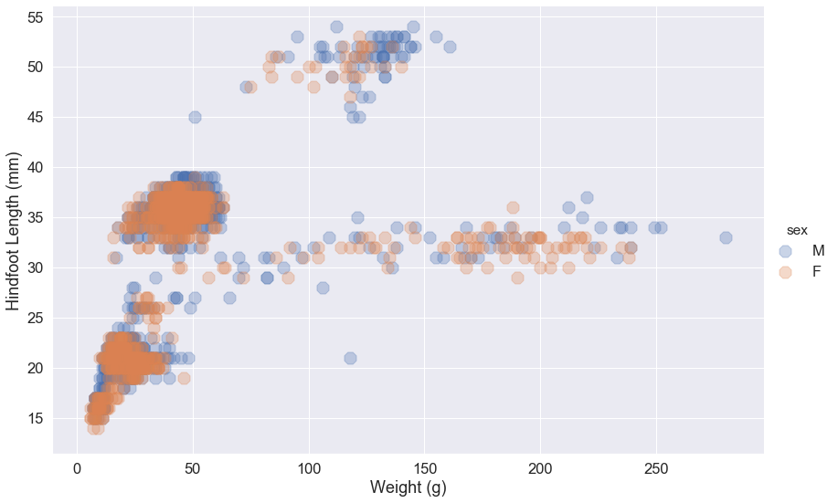
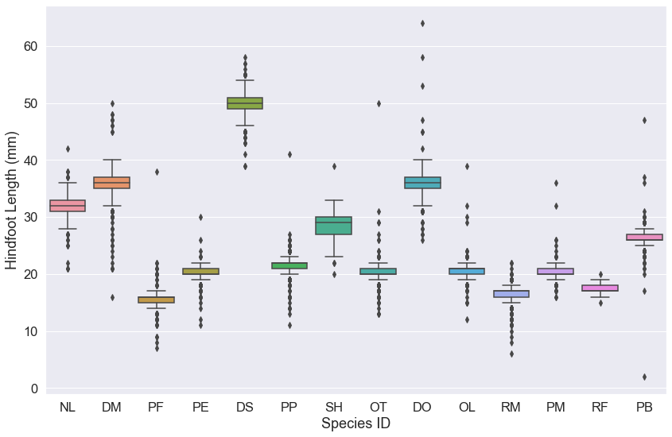
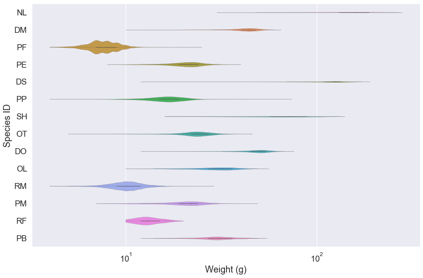
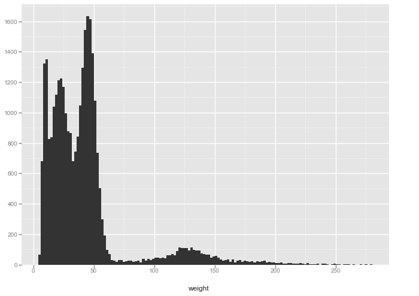
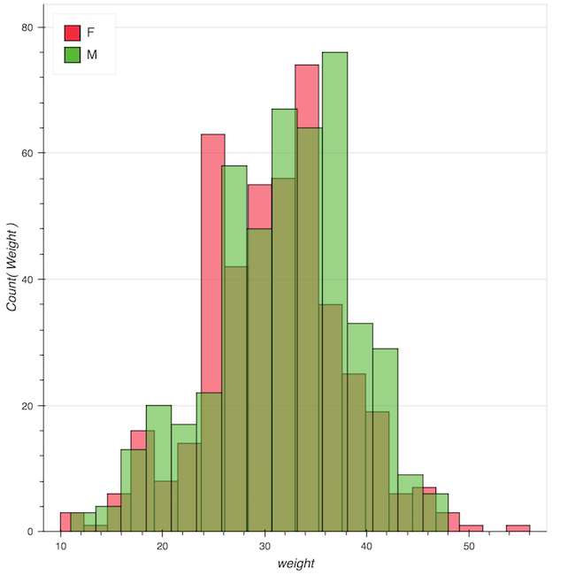

# Plotting with `seaborn`

Python has powerful built-in plotting capabilities and
for this exercise, we will focus on using the [`seaborn`](https://seaborn.pydata.org/)
package, which facilitates the creation of highly-informative plots of
structured data.
The `seaborn` library is built on `matplotlib` and features very nice color palettes. This library makes manipulating the features of a `matplotlib` plot somewhat easier. For an introduction to this package, see the [`seaborn` documentation](https://seaborn.pydata.org/introduction.html).

To install the package, use `conda`:

```
$ conda install seaborn
```

For this exercise, we will use a different data file, called "`surveys_complete.csv`", containing all the complete data observations from the plot surveys used in previous lessons. Download this file from the [`python-bcb546`](https://github.com/EEOB-BioData/BCB546X-Fall2017/tree/master/python-bcb546) folder on the course repository or pull the all new changes from the repository if you haven't done so already. 

## Getting Started

Create a new Jupyter notebook for this lesson and
begin by importing the Pandas package and seaborn.

~~~
import pandas as pd
import seaborn as sns
~~~
{: .python}

Here, we have given seaborn the alias `sns`. 

Also, remember that you need to include an inline command if you're using a Jupyter notebook or IPython in spyder:

~~~
%matplotlib inline
~~~
{: .python}

Now load the DataFrame:

~~~
surveys_complete = pd.read_csv('surveys_complete.csv', index_col=0)
~~~
{: .python}

## A Simple Scatterplot

Let's start with a basic scatterplot. We'll simply plot the weight on the x-axis and the hindfoot length on the y-axis. This uses the seaborn function `.lmplot()`. This function can take a Pandas DataFrame directly. It also will fit a regression line, by default. Since we may not want to visualize these data with a regression line, we will use the `fit_reg=False` argument.

~~~
sns.lmplot("weight", "hindfoot_length", data=surveys_complete, fit_reg=False)
~~~
{: .python}


Out of the box, seaborn will plot with a given set of aesthetics. We may want to change the label font size and make the background gray. For this, we can call the `.set()` method. If this method is called without any arguments, `sns.set()`, this will switch on the seaborn defaults, which changes the background color to gray and overlays white grid lines (i.e., a similar background to ggplot2 in R). We can add an argument to also change the font size for all of our downstream figures:

~~~
sns.set(font_scale=1.5)
~~~
{: .python}

This will increase the font size of the labels by 50% in all of our subsequent plots.

~~~
sns.lmplot("weight", "hindfoot_length", data=surveys_complete, fit_reg=False)
~~~
{: .python}


The plot size is small, by default, and with seaborn, there isn't a way to change the size of every plot with a single function. Further, this is done differently depending on the plot function we use because some functions return matplotlib objects and others are drawn using a grid object. 

For `.lmplot()`, we can set the plot size directly as arguments in the function call using the `size` and `aspect` arguments. These arguments control the height and width of the object, respectively.  

~~~
sns.lmplot("weight", "hindfoot_length", data=surveys_complete, fit_reg=False, size=8, aspect=1.5)
~~~
{: .python}


### Changing marker aesthetics

One issue with this plot is that because we have a large dataset, it is difficult to adequately visualize the points on our graph. This is called "[overplotting](https://python-graph-gallery.com/134-how-to-avoid-overplotting-with-python/)". One way to avoid this is to change the size of the marker. Here we use the argument `scatter_kws` that takes a _dictionary_ of keywords and values that are passed to the matplotlib `scatter` function.

~~~
sns.lmplot("weight", "hindfoot_length", data=surveys_complete, fit_reg=False, size=8, aspect=1.5, scatter_kws={"s": 5})
~~~
{: .python}


Alternatively, we can change the marker type using the `markers` keyword argument. By default, `lmplot()` sets `markers='8'`. If we want to change the marker, we must use the correct [matplotlib code](https://matplotlib.org/examples/lines_bars_and_markers/marker_reference.html). Let's change the markers to X-es:

~~~
sns.lmplot("weight", "hindfoot_length", data=surveys_complete, fit_reg=False, size=8, aspect=1.5, markers='x')
~~~
{: .python}


Another way to avoid overplotting is to use transparency so that regions of the plot with many points are darker. This is achieved using the `scatter_kws` argument and setting the alpha value. (This is using [alpha compositing](https://en.wikipedia.org/wiki/Alpha_compositing).)

~~~
sns.lmplot("weight", "hindfoot_length", data=surveys_complete, fit_reg=False, size=8, aspect=1.5, scatter_kws={'alpha':0.3})
~~~
{: .python}


### Coloring markers by a categorical value

We can also specify that the `species_id` labels indicate categories that determine a point's color:

~~~
sns.lmplot("weight", "hindfoot_length", data=surveys_complete, fit_reg=False, size=8,
           aspect=1.5, scatter_kws={'alpha':0.3,"s": 50}, hue='species_id', markers='D')
~~~
{: .python}


### Setting the axis labels

There are different ways to set figure properties using seaborn. For `.lmplot()`, we can create a figure variable and use a member method of tat variable to set the axis labels. 

~~~
my_fig = sns.lmplot("weight", "hindfoot_length", data=surveys_complete, fit_reg=False, size=8, 
                    aspect=1.5, scatter_kws={'alpha':0.3,"s": 50}, hue='species_id', markers='D')
my_fig.set_axis_labels('Weight', 'Hindfoot Length')
~~~
{: .python}


> ## Scatter plot for a single plot
>
> How would you plot the hind foot length and weight for just a single plot?
> Remember how to access subsets of a DataFrame based on conditional criteria?
> Plot the scatter plot above for only plot number `12` and color by `sex`. (Make the markers larger circles.)
>
> > ## Solution
> > 
> > ~~~
> > my_fig = sns.lmplot("weight", "hindfoot_length", data=surveys_complete[surveys_complete.plot_id == 12], fit_reg=False, size=8, 
                    aspect=1.5, scatter_kws={'alpha':0.3,"s": 200}, hue='sex', markers='8')
my_fig.set_axis_labels('Weight', 'Hindfoot Length')
> > ~~~
> > {: .python}
> > 
> > 
> {: .solution}
{: .challenge}


# Box Plots & Violin Plots

We often like to compare the distributions of values across different categorical variables. Box plots and violin plots are often used to do this in a simple way. 

In seaborn, both the `.boxplot()` and `.violinplot()` functions return matplotlib Axes objects. Thus, these plot functions do not have arguments for `size` and `aspect` like the scatter plot function above. 

In order to change the size of these plots, we must create a matplotlib figure and axes and set the dimentions of the figure. First, let's decide on the figure size we will use for the rest of our seaborn plots.

~~~
plot_dims = (14, 9)
~~~
{: .python}

Now, every time we create a new plot that returns a matplotlib Axes object, we can call the `.subplots()` function to change some of the aesthetics. Because of the iteritve way in which figures are built using matplotlib, we need to always execute our creation of the figure and the plot function in a single notebook cell. 

~~~
fig, ax = plt.subplots(figsize=plot_dims)
sns.boxplot('species_id','hindfoot_length', data=surveys_complete)
ax.set(xlabel='Species ID', ylabel='Hindfoot Length')
~~~
{: .python}



Note that for the `.boxplot()` function, we can simply set the x and y values by giving the column names from our DataFrame. Then we must use the `data=surveys_complete` argument to indicate our DataFrame object.

Now let's use a violin plot to visualize the weight data. For these data, we would also like the weight to be on the log10 scale. We will make this plot horizontal, so we'll set the x-axis to be on the log scale. 
An easy way to do this is to create a new graph variable from our `.violinplot()` function and then call the `.set_xscale()` that is a member method of the graph variable.

~~~
fig, ax = plt.subplots(figsize=dims)
g = sns.violinplot('weight','species_id', data=surveys_complete, linewidth=0.2, orient="h", cut=0)
g.set_xscale('log', basex=10)
ax.set(ylabel='Species ID', xlabel='Weight')
~~~
{: .python}



> ## Violin plot for a single species
>
> Use seaborn to make a violin plot comparing the relative distributions of weight 
> measurements for different sexed animals from a single 
> species, [*Onychomys leucogaster* (OL)](https://en.wikipedia.org/wiki/Northern_grasshopper_mouse), one of the coolest rodent species:
>
> > ## Solution
> > 
> > <!-- ~~~
> > fig, ax = plt.subplots(figsize=dims)
sns.violinplot(x = 'sex', y = 'weight', data=surveys_complete[surveys_complete.species_id == 'OL'])
> > ~~~
> > {: .python}
> > 
> >  -->
> {: .solution}
{: .challenge}

<!-- # Histograms

Often, a histogram is a better way to visualize a distribution. This is relatively simple using seaborn's `.distplot()` function. This function does not take a Pandas DataFrame, but can take a Pandas Series (i.e., column in our DataFrame). This function also can take come other arguments like `color`, which takes values that specify the color of histogram based on [matplotlib's colors](https://matplotlib.org/api/colors_api.html). We will make our plot cyan using the `'c'` color code.

~~~
fig, ax = plt.subplots(figsize=dims)
sns.distplot(surveys_complete['weight'], color='c')
~~~
{: .python}


By default, the `.distplot()` function plots the histogram as a density plot with the kernel density estimate overlaid as a darker line on the graph. This may not be necessary and we may instead want the y-axis to represent the counts in each bin. We can further adjust the appearance of the histogram to make the bars more apparent and increase the number of bins.

~~~
fig, ax = plt.subplots(figsize=dims)
sns.distplot(surveys_complete['weight'], kde=False, color='c', hist_kws=dict(edgecolor="k", linewidth=1), bins=100)
~~~
{: .python}

 -->


### To be continued...

<!-- 
The points plotted show the spread of measurements. However, you will notice that box plots do not allow you to really visualize the relative distributions of your data. Thus, if you had some species that had strongly bimodal hind-foot length distributions, that would not be captured here. 

Violin plots provide a visual representation of the *shape* of a distribution. Compare the `weight` measurements of each species using violin plots on a log scale:

~~~
ggplot( aes(x = 'species_id', y = 'weight'), data = surveys_complete) + geom_violin() + scale_y_log(base=10)
~~~
{: .python}


# Histograms

Often, a histogram is a better way to visualize a distribution. Plotting histograms is easy with `ggplot` using `geom_histogram()`:

~~~
ggplot(aes(x = 'weight'), data=surveys_complete) + geom_histogram(binwidth=2)
~~~
{: .python}



You can change the fill of the bars to be colored according to the `species_id`, to compare the weight distributions among species:

~~~
ggplot(aes(x = 'weight', fill='species_id'), data=surveys_complete) + geom_histogram(binwidth=2)
~~~
{: .python}


# Other Plotting Tools in Python

Ultimately, the functionality of `ggplot` in Python is not quite as rich as it is for `ggplot2` in R. This is partly because Python offers many other tools for complex visualization including `matplotlib`, [`seaborn`](https://seaborn.pydata.org/), and [`bokeh`](http://bokeh.pydata.org/en/latest/). 

For example, `seaborn` is a very nice library built on `matplotlib` that also features very nice color palettes. To install this package you need to use `conda` in your **Unix** terminal (not in Python):

```
$ conda install seaborn
```

Now, `seaborn` can be used to make very nice violin plots comparing the relative distributions of weight measurements for different sexed animals from a single species, *Onychomys leucogaster*:

~~~
import seaborn as sns
ax = sns.violinplot(x = 'sex', y = 'weight', data=surveys_complete[surveys_complete.species_id == 'OL'], palette="Set2")
~~~
{: .python}


Another library called `bokeh` can create amazing, interactive graphics using D3.js (javascript). This package is also easy to install with `conda`:

```
$ conda install bokeh
```

We will use this to view histograms of the male and female weights observed for *Onychomys leucogaster*.
First, load the package and options for inline notebook output and the components for a histogram:

~~~
from bokeh.io import push_notebook, show, output_notebook
from bokeh.charts import Histogram
output_notebook()
~~~
{: .python}


~~~
hist = Histogram(surveys_complete[surveys_complete.species_id == 'OL'], values="weight", color="sex")
show(hist)
~~~
{: .python}



Notice the tool buttons on the side of your graph. These allow you to interact with your graphical image in an intuitive way using javascript. 


Choosing the right tool depends on what you need to do. All of these plotting libraries use different vocabularies to create graphical images, and this can make going between them difficult.  -->
