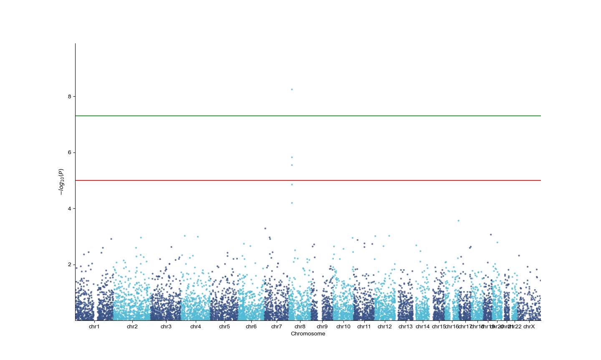
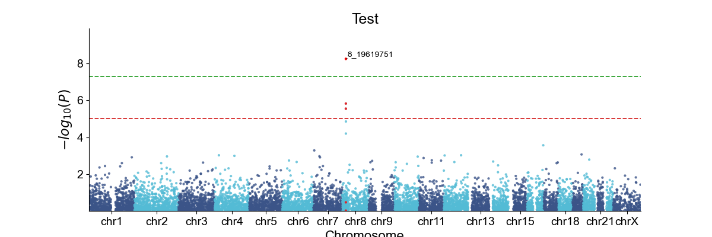
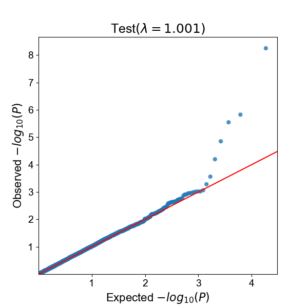

# Biopython Background

Biopython is a freely available package for working with molecular biological data.
In this lesson, we will just cover some basics of working with Biopython. 
The developers of this package have written a comprehensive [tutorial and cookbook](http://biopython.org/DIST/docs/tutorial/Tutorial.html).

## What can Biopython do?

The [documentation page for Biopython](http://biopython.org/DIST/docs/tutorial/Tutorial.html#htoc3) provides a list of the many
different tools in the package:

- The ability to parse bioinformatics files into Python utilizable data structures, including support for the following formats:
  - Blast output – both from standalone and WWW Blast
  - Clustalw
  - FASTA
  - GenBank
  - PubMed and Medline
  - ExPASy files, like Enzyme and Prosite
  - SCOP, including 'dom' and 'lin' files
  - UniGene
  - SwissProt 
- Files in the supported formats can be iterated over record by record or indexed and accessed via a Dictionary interface.
- Code to deal with popular on-line bioinformatics destinations such as:
  - NCBI – Blast, Entrez and PubMed services
  - ExPASy – Swiss-Prot and Prosite entries, as well as Prosite searches 
- Interfaces to common bioinformatics programs such as:
  - Standalone Blast from NCBI
  - Clustalw alignment program
  - EMBOSS command line tools 
- A standard sequence class that deals with sequences, ids on sequences, and sequence features.
- Tools for performing common operations on sequences, such as translation, transcription and weight calculations.
- Code to perform classification of data using k Nearest Neighbors, Naive Bayes or Support Vector Machines.
- Code for dealing with alignments, including a standard way to create and deal with substitution matrices.
- Code making it easy to split up parallelizable tasks into separate processes.
- GUI-based programs to do basic sequence manipulations, translations, BLASTing, etc.
- Extensive documentation and help with using the modules, including this file, on-line wiki documentation, the web site, and the mailing list.
- Integration with BioSQL, a sequence database schema also supported by the BioPerl and BioJava projects.

# Getting Started

## Install Biopython and Create a Jupyter Notebook

The easiest way to install the Biopython tools is to use `conda`. From your terminal, you simply need to execute the following:

```bash
conda install biopython
```

Alternatively, you can use pip:

```bash
pip install biopython
```

Now create a new Jupyter notebook for this lesson. 

# Working with Biopython

## The `Seq` Object

The `Seq` object class is simple and fundamental for a lot of
Biopython work. A Seq object can contain DNA, RNA, or protein.
It contains a string (the sequence) and a defined alphabet for that string.
The alphabets are actually defined objects such as `IUPACAmbiguousDNA` or 
`IUPACProtein`. A Seq object with a DNA alphabet has some different methods than one with an Amino Acid alphabet.

First, import the `Seq` object from Biopython

~~~python
from Bio.Seq import Seq
~~~

Now we can create a `Seq` object: 

~~~python
my_seq = Seq("AGTACACTGGT")
my_seq
~~~
~~~output
Seq('AGTACACTGGT')
~~~

The nice thing about the sequence object is 
that it can be treated just like a Python string object.

~~~python
print(my_seq[:3])
~~~
~~~output
AGT
~~~

`Seq` objects also have string methods like `.count()`

~~~python
my_seq.count('AC')
~~~
~~~output
2
~~~

And you can use functions that act on strings like `len()`

~~~python
len(my_seq)
~~~
~~~output
11
~~~

`Seq` objects also have special methods. For example, you can get the reverse complement of a sequence:

~~~python
my_seq = Seq("GATCGATGGGCCTATATAGGATCGAAAATCGC")
print(my_seq.reverse_complement())
~~~
~~~output
GCGATTTTCGATCCTATATAGGCCCATCGATC
~~~

Just like strings in Python, the `Seq` object is immutable, 
meaning you cannot change it. If you try to change one of the sites in this
sequence, you will get an error. If you want an editable sequence object, you
will need to create a `MutableSeq` object. 

~~~python
from Bio.Seq import MutableSeq
mutable_seq = MutableSeq("GCCATTGTAATGGGCCGCTGAAAGGGTGCCCGA")
~~~

Now you can try changing the nucleotide at index 3 to `'G'`.

## The `SeqRecord` Object

Biopython's `SeqRecord` is a complex object that contains a 
`Seq` object as well as other fields for attributes of that 
sequence (i.e., metadata). These attributes are also called 
"annotation fields":

- `.seq` - The sequence itself, typically a Seq object.
- `.id` - The primary ID used to identify the sequence – a string.
- `.name` - A "common" name/id for the sequence – a string.
- `.description` - A human readable description or expressive name for the sequence.
- `.letter_annotations` - Holds per-letter-annotations using a dictionary.
- `.annotations` - A dictionary of additional information about the sequence.
- `.features` - A list of SeqFeature objects with more structured information.
- `.dbxrefs` - A list of database cross-references as strings. 

You can create a `SeqRecord` by giving the constructor a `Seq` object:

~~~python
from Bio.SeqRecord import SeqRecord
simple_seq = Seq("GATC")
simple_seq_r = SeqRecord(simple_seq)
~~~

And you can provide attributes:

~~~python
simple_seq_r.id = "AC12345"
simple_seq_r.description = "This sequence is pretend."
print(simple_seq_r)
~~~
~~~output
ID: AC12345
Name: <unknown name>
Description: This sequence is pretend.
Number of features: 0
Seq('GATC')
~~~

## Reading Sequences from FASTA files

`SeqIO` enables reading in sequences from FASTA files and storing the data in a `SeqRecord`. Additionally `SeqIO` provides tools for writing sequence data to a file.

We will read in the example file using `SeqIO`. First, let's download a sample FASTA file:

~~~python
import os
import urllib.request

# Download a sample FASTA file if it doesn't exist
fasta_url = "https://raw.githubusercontent.com/biopython/biopython/master/Doc/examples/ls_orchid.fasta"
fasta_file = "ls_orchid.fasta"

if not os.path.isfile(fasta_file):
    try:
        urllib.request.urlretrieve(fasta_url, fasta_file)
        print(f"Downloaded {fasta_file}")
    except Exception as e:
        print(f"Error downloading file: {e}")
        print("Please download the file manually from:")
        print(fasta_url)
~~~

Now read the FASTA file:

~~~python
from Bio import SeqIO

# Read a single record
record = SeqIO.read(fasta_file, "fasta")
print(f"Sequence ID: {record.id}")
print(f"Sequence length: {len(record.seq)}")
print(f"First 50 bases: {record.seq[:50]}")
~~~
~~~output
Sequence ID: gi|2765658|emb|Z78533.1|CIZ78533
Sequence length: 740
First 50 bases: CGTAACAAGGTTTCCGTAGGTGAACCTGCGGAAGGATCATTGATGAGACCGTG
~~~

> ## Find out more about this sequence
>
> Use string methods and the `SeqRecord` attributes to get the length of the sequence
> and the species name.
>
> > ## Solution
> > 
> > Get the length using `len()`: 
> > ~~~python
> > len(record.seq)
> > ~~~
> > ~~~output
> > 740
> > ~~~
> >
> > The species name is given in the description of this FASTA file:
> > ~~~python
> > record.description
> > ~~~
> > ~~~output
> > 'gi|2765658|emb|Z78533.1|CIZ78533 C.irapeanum 5.8S rRNA gene and ITS1 and ITS2 DNA'
> > ~~~
> {: .solution}
{: .challenge}

Using `SeqIO` we can read in several sequences from a file and store 
them in a list of `SeqRecord` objects. 

~~~python
# Read multiple sequences
records = list(SeqIO.parse(fasta_file, "fasta"))
print(f"Number of sequences: {len(records)}")
for i, rec in enumerate(records[:3]):
    print(f"Record {i+1}: {rec.id} - {len(rec.seq)} bp")
~~~
~~~output
Number of sequences: 94
Record 1: gi|2765658|emb|Z78533.1|CIZ78533 - 740 bp
Record 2: gi|2765657|emb|Z78532.1|CIZ78532 - 753 bp
Record 3: gi|2765656|emb|Z78531.1|CIZ78531 - 748 bp
~~~

## Robust Data Download from NCBI

### Setting Up NCBI Entrez with Error Handling

Before using the online NCBI resources, it is important to be aware of the user 
requirements. If you abuse their system (whether on purpose or on accident), 
they will block your access for some time. 
You can find the requirements in the 
[NCBI E-utilities guide](https://www.ncbi.nlm.nih.gov/books/NBK25497/#chapter2.Usage_Guidelines_and_Requiremen). 

First, you are required to provide NCBI with 
your identity so that you can be contacted 
if there is a problem. This also limits abuse of this system so that 
their servers aren't overwhelmed. 

The quote below from the 
[NCBI guide](https://www.ncbi.nlm.nih.gov/books/NBK25497/#chapter2.Usage_Guidelines_and_Requiremen) 
gives you a sense of what constitutes appropriate usage of 
the E-utility servers:

> In order not to overload the E-utility servers, NCBI recommends that users post no more than three URL requests per second and limit large jobs to either weekends or between 9:00 PM and 5:00 AM Eastern time during weekdays.

### Robust Entrez Setup with Error Handling

~~~python
from Bio import Entrez
import time
import sys

# Set your email address - REQUIRED by NCBI
Entrez.email = "your_email@example.com"  # Replace with your actual email

# Optional: Set a tool name to identify your application
Entrez.tool = "Biopython_Tutorial"

# Function to handle rate limiting and retries
def fetch_with_retry(func, max_retries=3, delay=5, *args, **kwargs):
    """
    Fetch data from NCBI with retry logic and rate limiting.
    
    Parameters:
    - func: The Entrez function to call
    - max_retries: Maximum number of retry attempts
    - delay: Delay in seconds between retries
    - *args, **kwargs: Arguments to pass to the function
    """
    for attempt in range(max_retries):
        try:
            # Add a small delay to respect NCBI rate limits
            time.sleep(0.5)  # 0.5 second delay between requests
            result = func(*args, **kwargs)
            return result
        except Exception as e:
            print(f"Attempt {attempt + 1} failed: {e}")
            if attempt < max_retries - 1:
                print(f"Retrying in {delay} seconds...")
                time.sleep(delay)
            else:
                print(f"All {max_retries} attempts failed.")
                raise
~~~

### Downloading a GenBank Record

Now we can fetch a Genbank record with robust error handling:

~~~python
# Function to download a GenBank record
def download_genbank(accession, output_format="genbank"):
    """
    Download a GenBank record from NCBI with error handling.
    
    Parameters:
    - accession: GenBank accession number
    - output_format: Format to return ('genbank' or 'fasta')
    
    Returns:
    - SeqRecord object or None if failed
    """
    try:
        print(f"Fetching {accession} from NCBI...")
        handle = fetch_with_retry(
            Entrez.efetch,
            db="nucleotide",
            id=accession,
            rettype=output_format,
            retmode="text"
        )
        record = SeqIO.read(handle, output_format)
        handle.close()
        print(f"Successfully downloaded {accession}")
        return record
    except Exception as e:
        print(f"Error downloading {accession}: {e}")
        return None

# Download a GenBank record
accession = "DQ137224"  # Yellow-eyed penguin cytochrome b
record = download_genbank(accession, "genbank")

if record:
    print(f"ID: {record.id}")
    print(f"Name: {record.name}")
    print(f"Description: {record.description}")
    print(f"Length: {len(record.seq)} bp")
    print(f"Organism: {record.annotations.get('organism', 'Unknown')}")
    print(f"Taxonomy: {record.annotations.get('taxonomy', [])}")
else:
    print("Failed to download record.")
~~~

### Downloading Multiple Records with Rate Limiting

~~~python
def download_multiple_genbank(accessions, output_format="genbank", delay=1.0):
    """
    Download multiple GenBank records with rate limiting.
    
    Parameters:
    - accessions: List of accession numbers
    - output_format: Format to return ('genbank' or 'fasta')
    - delay: Delay in seconds between requests
    
    Returns:
    - List of SeqRecord objects
    """
    records = []
    for i, accession in enumerate(accessions):
        print(f"Downloading {i+1}/{len(accessions)}: {accession}")
        record = download_genbank(accession, output_format)
        if record:
            records.append(record)
        # Add delay between requests to respect rate limits
        if i < len(accessions) - 1:
            time.sleep(delay)
    return records

# Example: Download multiple records
accessions = ["DQ137224", "DQ137225", "DQ137226"]
records = download_multiple_genbank(accessions, "genbank", delay=1.0)
print(f"Successfully downloaded {len(records)} records")
~~~

### Saving Records to Files

~~~python
# Function to save records to a file
def save_records(records, output_file, format="genbank"):
    """
    Save SeqRecord objects to a file.
    
    Parameters:
    - records: List of SeqRecord objects
    - output_file: Output file path
    - format: Output format ('genbank' or 'fasta')
    """
    try:
        with open(output_file, "w") as handle:
            SeqIO.write(records, handle, format)
        print(f"Successfully saved {len(records)} records to {output_file}")
    except Exception as e:
        print(f"Error saving records: {e}")

# Save downloaded records
if records:
    save_records(records, "downloaded_records.gbk", "genbank")
    save_records(records, "downloaded_records.fasta", "fasta")
~~~

### Searching NCBI Databases

~~~python
def search_ncbi(db, term, retmax=10, email=None):
    """
    Search NCBI databases and return a list of IDs.
    
    Parameters:
    - db: Database to search (e.g., "nucleotide", "protein")
    - term: Search term
    - retmax: Maximum number of results to return
    - email: Email address (required by NCBI)
    
    Returns:
    - List of IDs
    """
    if email:
        Entrez.email = email
    
    try:
        print(f"Searching {db} for '{term}'...")
        handle = Entrez.esearch(db=db, term=term, retmax=retmax)
        search_results = Entrez.read(handle)
        handle.close()
        
        ids = search_results.get("IdList", [])
        print(f"Found {len(ids)} results")
        return ids
    except Exception as e:
        print(f"Error searching NCBI: {e}")
        return []

# Example: Search for sequences
search_term = "yellow-eyed penguin cytochrome b"
ids = search_ncbi("nucleotide", search_term, retmax=5)

if ids:
    print(f"Found IDs: {ids}")
    # Download the first result
    if ids:
        record = download_genbank(ids[0])
        if record:
            print(f"\nFirst result: {record.id}")
            print(f"Description: {record.description}")
~~~

### Downloading with Batch Entrez

For downloading many sequences, use `efetch` with multiple IDs:

~~~python
def download_batch_genbank(id_list, email=None):
    """
    Download multiple GenBank records using batch efetch.
    
    Parameters:
    - id_list: List of NCBI IDs
    - email: Email address (required by NCBI)
    
    Returns:
    - List of SeqRecord objects
    """
    if email:
        Entrez.email = email
    
    try:
        # Join IDs with commas
        ids = ",".join(id_list)
        print(f"Batch fetching {len(id_list)} records...")
        
        handle = fetch_with_retry(
            Entrez.efetch,
            db="nucleotide",
            id=ids,
            rettype="gb",
            retmode="text"
        )
        
        records = list(SeqIO.parse(handle, "genbank"))
        handle.close()
        print(f"Successfully fetched {len(records)} records")
        return records
    except Exception as e:
        print(f"Error in batch download: {e}")
        return []

# Example: Batch download
if len(ids) > 1:
    batch_records = download_batch_genbank(ids[:5])  # Download first 5
    print(f"Downloaded {len(batch_records)} records in batch")
~~~

### BLAST with Error Handling

BioPython makes it easy to work with NCBI's BLAST. To run 
blast over the internet, we can use `qblast()`. 

~~~python
from Bio.Blast import NCBIWWW, NCBIXML

def run_blast_with_retry(sequence, program="blastn", database="nt", max_retries=3, delay=10):
    """
    Run BLAST search with retry logic.
    
    Parameters:
    - sequence: Seq object or string
    - program: BLAST program (blastn, blastp, etc.)
    - database: Database to search
    - max_retries: Maximum number of retry attempts
    - delay: Delay in seconds between retries
    
    Returns:
    - Handle to BLAST results
    """
    for attempt in range(max_retries):
        try:
            print(f"Running BLAST (attempt {attempt + 1})...")
            time.sleep(0.5)  # Rate limiting
            result_handle = NCBIWWW.qblast(program, database, sequence)
            return result_handle
        except Exception as e:
            print(f"BLAST attempt {attempt + 1} failed: {e}")
            if attempt < max_retries - 1:
                print(f"Retrying in {delay} seconds...")
                time.sleep(delay)
            else:
                print("All BLAST attempts failed.")
                raise

# Example: Run BLAST
def run_blast_example():
    # Use a sample sequence
    sample_seq = "ACACAAATTCTAACTGGCCTCCTACTGGCCGCCCACTACACTGCAGACACAACC"
    seq_obj = Seq(sample_seq)
    
    try:
        result_handle = run_blast_with_retry(seq_obj, "blastn", "nt")
        
        # Save results to file
        with open("blast_results.xml", "w") as out_handle:
            out_handle.write(result_handle.read())
        result_handle.close()
        
        # Parse results
        with open("blast_results.xml") as in_handle:
            blast_record = NCBIXML.read(in_handle)
        
        # Display top hits
        print("\nTop BLAST hits:")
        for i, alignment in enumerate(blast_record.alignments[:5]):
            print(f"{i+1}. {alignment.title[:60]}...")
            print(f"   Score: {alignment.hsps[0].score}")
            print(f"   E-value: {alignment.hsps[0].expect}")
            print()
            
        return blast_record
    except Exception as e:
        print(f"BLAST failed: {e}")
        return None

# Uncomment to run BLAST (this may take time)
# blast_record = run_blast_example()
~~~

## Visualizing Genomics Data with Geneview

geneview is a library for making attractive and informative genomics graphics in Python. It is built on top of matplotlib and tightly integrated with the PyData stack, including support for numpy and pandas data structures.

To install geneview:

```bash
pip install geneview
```

### Manhattan Plot

We use a PLINK2.x association output data `gwas.csv` which is in [geneview-data](https://github.com/ShujiaHuang/geneview-data) directory, as the input for the plots below.

~~~python
import matplotlib.pyplot as plt
import geneview as gv

# Load data from the geneview package
try:
    df = gv.load_dataset("gwas")
    print("Data loaded successfully")
    print(df.head())
except Exception as e:
    print(f"Error loading data: {e}")
    print("Creating sample data for demonstration...")
    # Create sample data if real data is not available
    import pandas as pd
    import numpy as np
    np.random.seed(42)
    df = pd.DataFrame({
        'CHR': np.repeat(range(1, 23), 100),
        'BP': np.random.randint(1, 250000000, 2200),
        'P': np.random.exponential(0.1, 2200),
        'ID': [f'rs{i}' for i in range(2200)]
    })
    df.loc[df['P'] > 1, 'P'] = 1  # Cap P-values

# Plot a basic manhattan plot
plt.figure(figsize=(12, 6))
ax = gv.manhattanplot(data=df)
plt.title("Manhattan Plot of GWAS Results")
plt.show()
~~~



### Customized Manhattan Plot

Rotate the x-axis tick label by setting xticklabel_kws to avoid label overlap:

~~~python
import matplotlib.pyplot as plt
import geneview as gv

# Common parameters for plotting
plt_params = {
    "pdf.fonttype": 42,
    "font.sans-serif": "Arial",
    "legend.fontsize": 14,
    "axes.titlesize": 18,
    "axes.labelsize": 16,
    "xtick.labelsize": 14,
    "ytick.labelsize": 14
}
plt.rcParams.update(plt_params)

# Create a manhattan plot
f, ax = plt.subplots(figsize=(12, 4), facecolor="w", edgecolor="k")
xtick = set(["chr" + str(i) for i in list(map(str, range(1, 10))) + ["11", "13", "15", "18", "21", "X"]])

_ = gv.manhattanplot(data=df,
                     marker=".",
                     sign_marker_p=1e-6,  # Genome wide significant p-value
                     sign_marker_color="r",
                     snp="ID",  # The column name of annotation information for top SNPs
                     title="Test",
                     xtick_label_set=xtick,
                     xlabel="Chromosome",
                     ylabel=r"$-log_{10}{(P)}$",
                     sign_line_cols=["#D62728", "#2CA02C"],
                     hline_kws={"linestyle": "--", "lw": 1.3},
                     is_annotate_topsnp=True,
                     ld_block_size=50000,  # 50000 bp
                     text_kws={"fontsize": 12,
                               "arrowprops": dict(arrowstyle="-", color="k", alpha=0.6)},
                     ax=ax)
plt.show()
~~~



### QQ Plot with Default Parameters

The qqplot() function can be used to generate a Q-Q plot to visualize the distribution of association "P-value". The qqplot() function takes a vector of P-values as its only required argument.

~~~python
import matplotlib.pyplot as plt
import geneview as gv

f, ax = plt.subplots(figsize=(6, 6), facecolor="w", edgecolor="k")
_ = gv.qqplot(data=df["P"],
              marker="o",
              title="Test",
              xlabel=r"Expected $-log_{10}{(P)}$",
              ylabel=r"Observed $-log_{10}{(P)}$",
              ax=ax)
plt.show()
~~~



### Download the Example GenBank File

~~~python
import os
import urllib.request

def download_example_file(url, filename):
    """
    Download a file from a URL with error handling.
    
    Parameters:
    - url: URL to download from
    - filename: Local filename to save as
    
    Returns:
    - Boolean indicating success
    """
    if not os.path.isfile(filename):
        try:
            print(f"Downloading {filename} from {url}...")
            urllib.request.urlretrieve(url, filename)
            print(f"Successfully downloaded {filename}")
            return True
        except Exception as e:
            print(f"Error downloading file: {e}")
            print(f"Please download the file manually from:")
            print(url)
            return False
    else:
        print(f"{filename} already exists.")
        return True

# Download the example GenBank file
gbk_url = "https://raw.githubusercontent.com/biopython/biopython/master/Doc/examples/ls_orchid.gbk"
gbk_file = "ls_orchid.gbk"

if download_example_file(gbk_url, gbk_file):
    # Read and display information about the file
    records = list(SeqIO.parse(gbk_file, "genbank"))
    print(f"\nFile contains {len(records)} GenBank records")
    print(f"First record ID: {records[0].id}")
    print(f"First record description: {records[0].description}")
~~~

## Complete Workflow Example

Here's a complete workflow that demonstrates downloading, processing, and analyzing sequence data:

~~~python
def complete_biopython_workflow():
    """
    Complete workflow: Search, download, and analyze sequences.
    """
    print("=== Biopython Complete Workflow ===\n")
    
    # Step 1: Search for sequences
    search_term = "cytochrome b penguin"
    print(f"1. Searching for '{search_term}'...")
    ids = search_ncbi("nucleotide", search_term, retmax=5)
    
    if not ids:
        print("No results found. Exiting workflow.")
        return
    
    print(f"Found {len(ids)} sequences.\n")
    
    # Step 2: Download sequences
    print("2. Downloading sequences...")
    records = []
    for i, acc in enumerate(ids[:3]):  # Limit to 3 for demonstration
        print(f"  Downloading {i+1}: {acc}")
        record = download_genbank(acc, "genbank")
        if record:
            records.append(record)
            # Print some info
            print(f"    Length: {len(record.seq)} bp")
            print(f"    Organism: {record.annotations.get('organism', 'Unknown')}")
            print(f"    GC content: {100 * (record.seq.count('G') + record.seq.count('C')) / len(record.seq):.1f}%\n")
    
    # Step 3: Save to file
    if records:
        print(f"3. Saving {len(records)} records to file...")
        save_records(records, "workflow_output.gbk", "genbank")
        save_records(records, "workflow_output.fasta", "fasta")
    
    # Step 4: Analyze sequences
    print("\n4. Analyzing sequences...")
    for i, record in enumerate(records):
        seq = record.seq
        length = len(seq)
        gc = 100 * (seq.count('G') + seq.count('C')) / length
        at = 100 * (seq.count('A') + seq.count('T')) / length
        
        print(f"\n  Sequence {i+1}: {record.id}")
        print(f"    Length: {length} bp")
        print(f"    GC Content: {gc:.1f}%")
        print(f"    AT Content: {at:.1f}%")
        print(f"    GC/AT Ratio: {gc/at:.2f}")
    
    print("\n=== Workflow Complete ===")

# Run the complete workflow
# Uncomment to run:
# complete_biopython_workflow()
~~~

> ## Take-Home Challenge: Biopython Sequence Analysis
>
> Experiment with features of biopython using the sequence you downloaded.
>
> 1. Download a human gene sequence from NCBI (e.g., BRCA1, TP53) using the robust download functions.
>
> 2. Calculate and print the GC content of the sequence.
>
> 3. Find all ORFs (Open Reading Frames) in the sequence using Biopython's `Seq` object methods.
>
> 4. Translate the sequence to protein and identify any potential domains.
>
> 5. Write your own function to calculate the molecular weight of the translated protein.
>
> > ## Solutions
> >
> > ~~~python
> > # 1. Download BRCA1 sequence
> > brca1 = download_genbank("NM_007294", "genbank")
> > if brca1:
> >     print(f"BRCA1: {len(brca1.seq)} bp")
> >     
> >     # 2. Calculate GC content
> >     seq = brca1.seq
> >     gc = 100 * (seq.count('G') + seq.count('C')) / len(seq)
> >     print(f"GC Content: {gc:.1f}%")
> >     
> >     # 3. Find ORFs
> >     from Bio.Seq import translate
> >     # Find ORFs (simple example - find all ATG to stop codons)
> >     orfs = []
> >     for frame in range(3):
> >         prot = translate(seq[frame:], to_stop=True)
> >         if len(prot) > 0:
> >             orfs.append((frame, len(prot)))
> >     print(f"ORFs found: {orfs}")
> >     
> >     # 4. Translate to protein
> >     protein = translate(seq[seq.find('ATG'):])
> >     print(f"Protein length: {len(protein)} aa")
> >     
> >     # 5. Calculate molecular weight
> >     def calc_molecular_weight(protein_seq):
> >         # Approximate molecular weight using average amino acid mass
> >         aa_weights = {
> >             'A': 89.09, 'R': 174.20, 'N': 132.12, 'D': 133.10,
> >             'C': 121.16, 'E': 147.13, 'Q': 146.15, 'G': 75.07,
> >             'H': 155.16, 'I': 131.17, 'L': 131.17, 'K': 146.19,
> >             'M': 149.21, 'F': 165.19, 'P': 115.13, 'S': 105.09,
> >             'T': 119.12, 'W': 204.23, 'Y': 181.19, 'V': 117.15
> >         }
> >         return sum(aa_weights.get(aa, 0) for aa in str(protein_seq))
> >     
> >     mol_weight = calc_molecular_weight(protein)
> >     print(f"Molecular weight: {mol_weight:.1f} Da")
> > ~~~
> {: .solution}
{: .challenge}


### Download the GenBank File

~~~
import os
if not os.path.isfile("ls_orchid.gbk"):
  os.system("wget https://raw.githubusercontent.com/biopython/biopython/master/Doc/examples/ls_orchid.gbk")
~~~
{: .python}
