# Plotting with `seaborn`

Python has powerful built-in plotting capabilities and
for this exercise, we will focus on using the [`seaborn`](https://seaborn.pydata.org/)
package, which facilitates the creation of highly-informative plots of
structured data.
The `seaborn` library is based on `matplotlib`.

To install the package, use `conda`:

```
$ conda install seaborn
```

For this exercise, we will use a different data file containing all the complete data observations from the plot surveys used in previous lessons. Download this file from the [`python-bcb546`](https://github.com/EEOB-BioData/BCB546X-Fall2017/tree/master/python-bcb546) folder on the course repository or pull the file if you haven't done so already. 

Create a new Jupyter notebook for this lesson and
begin by importing the Pandas package and seaborn.

~~~
import pandas as pd
import seaborn as sns
~~~
{: .python}

Also, remember that you need to include an inline command if you're using a Jupyter notebook or IPython in spyder:

~~~
%matplotlib inline
~~~
{: .python}

Now load the DataFrame:

~~~
surveys_complete = pd.read_csv('surveys_complete.csv', index_col=0)
~~~
{: .python}

<!--And let's give the column of row indices a name:

~~~
surveys_complete.index.name = 'X'
~~~
{: .python}

-->

From your R lessons, you are familiar with `ggplot` and know that it is a plotting package that makes it simple to create complex plots
from data in a DataFrame. It uses default settings, which help creating
publication quality plots with a minimal amount of settings and tweaking.

Graphics generated by `ggplot` are built step by step by adding new elements.

To build a `ggplot` graphical object, we need to:

- bind the plot to a specific data frame using the `data` argument

- define aesthetics (`aes`), by selecting the variables to be plotted and the variables to define the presentation such as plotting size, shape color, etc.

~~~
ggplot( aesthetics= aes(x = 'weight', y = 'hindfoot_length'), data = surveys_complete)
~~~
{: .python}


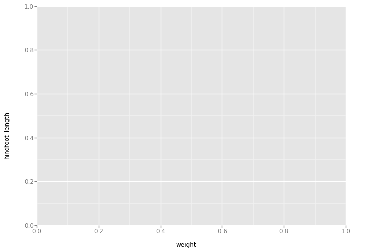


- add `geoms` -- graphical representation of the data in the plot (points,
     lines, bars). To add a `geom` to the plot use the `+` operator:

~~~
ggplot( aes(x = 'weight', y = 'hindfoot_length'), data = surveys_complete) + geom_point()
~~~
{: .python}


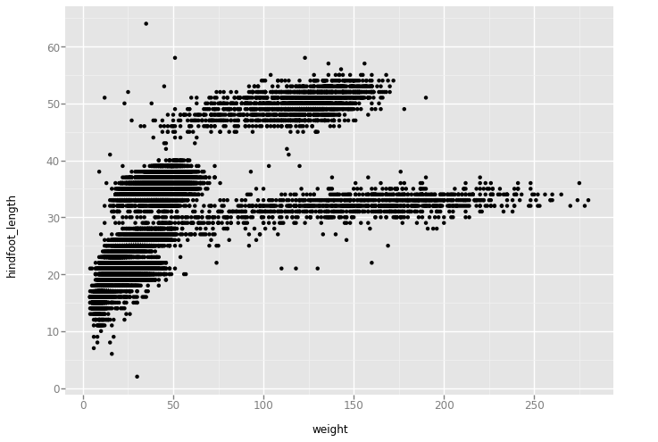


The `+` in the `ggplot` package is particularly useful because it allows you
to modify existing `ggplot` objects. This means you can easily set up plot
"templates" and conveniently explore different types of plots.

The above plot can also be generated by first creating a variable for the plot:

~~~
surveys_plot = ggplot( aes(x = 'weight', y = 'hindfoot_length'), data = surveys_complete)
~~~
{: .python}

Then drawing the plot by adding the `geom` element:

~~~
surveys_plot + geom_point()
~~~
{: .python}


Notes:

- Anything you put in the `ggplot()` function can be seen by any geom layers
  that you add (i.e., these are universal plot settings). This includes the x and
  y axis you set up in `aes()`.
- You can also specify aesthetics for a given `geom` independently of the
  aesthetics defined globally in the `ggplot()` function.


# Building your plots iteratively

Building plots with `ggplot` is typically an iterative process. We start by
defining the dataset we'll use, lay the axes, and choose a `geom`.

~~~
ggplot(aes(x = 'weight', y = 'hindfoot_length'), data = surveys_complete, ) + geom_point()
~~~
{: .python}


We can modify this plot to extract more information from our data. For
instance, we can add transparency (`alpha`) to avoid over plotting.

~~~
ggplot(aes(x = 'weight', y = 'hindfoot_length'), data = surveys_complete) + \
    geom_point(alpha = 0.1)
~~~
{: .python}


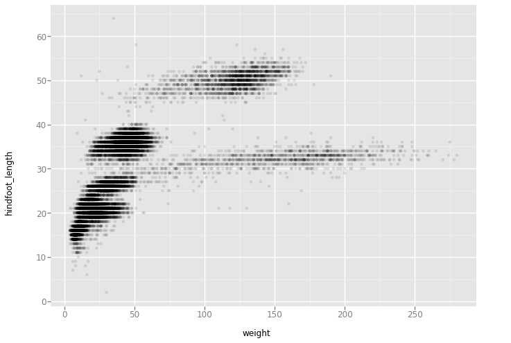


We can color all of the points blue:

~~~
ggplot(aes(x = 'weight', y = 'hindfoot_length'),data = surveys_complete) + \
    geom_point(alpha = 0.1, color = "blue")
~~~
{: .python}


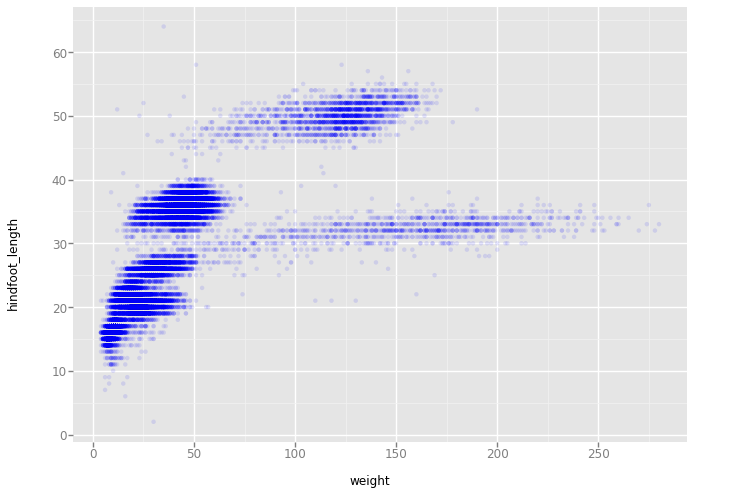


Or, we can specify that the `species_id` labels indicate categories that determine a point's color:

~~~
ggplot(aes(x = 'weight', y = 'hindfoot_length', color='species_id'),data = surveys_complete) + \
    geom_point( alpha = 0.1)
~~~
{: .python}


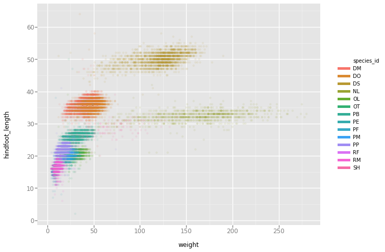


> ## Scatter plot for a single species
>
> How would you plot the hind foot length and weight for just a single species?
> Remember how to access subsets of a DataFrame based on conditional criteria?
> Plot the scatter plot above for only the species `RM` and color by `sex`.
>
> > ## Solution
> > 
> > ~~~
> > ggplot(aes(x = 'weight', y = 'hindfoot_length', color='sex'),data = surveys_complete[surveys_complete.species_id == 'RM']) + \
> >         geom_point( alpha = 0.5)
> > ~~~
> > {: .python}
> > 
> > 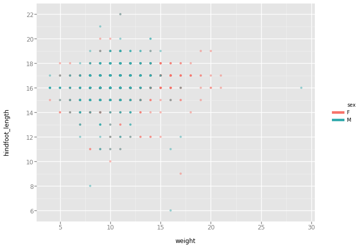
> {: .solution}
{: .challenge}


# Box Plots & Violin Plots

We often like to compare the distributions of values across different categorical variables. Box plots and violin plots allow us to do this easily. 

Let's use `ggplot` to create simple box plots comparing the hind foot measurements across all species in our DataFrame:

~~~
ggplot( aes(x = 'species_id', y = 'hindfoot_length'), data = surveys_complete) + geom_boxplot()
~~~
{: .python}


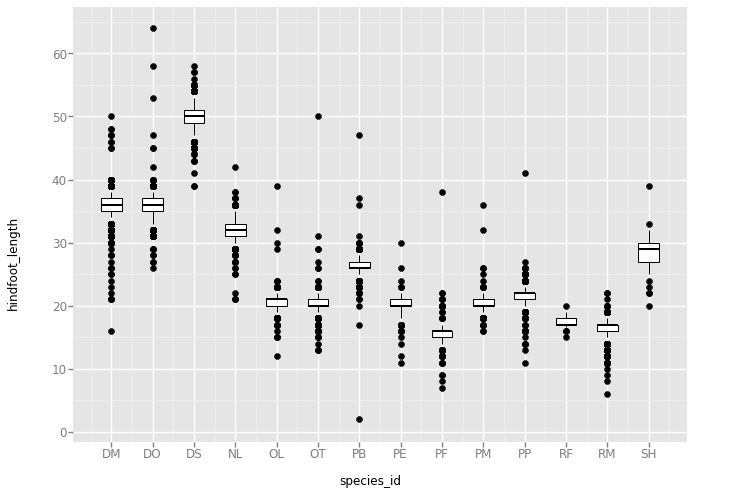

The points plotted show the spread of measurements. However, you will notice that box plots do not allow you to really visualize the relative distributions of your data. Thus, if you had some species that had strongly bimodal hind-foot length distributions, that would not be captured here. 

Violin plots provide a visual representation of the *shape* of a distribution. Compare the `weight` measurements of each species using violin plots on a log scale:

~~~
ggplot( aes(x = 'species_id', y = 'weight'), data = surveys_complete) + geom_violin() + scale_y_log(base=10)
~~~
{: .python}

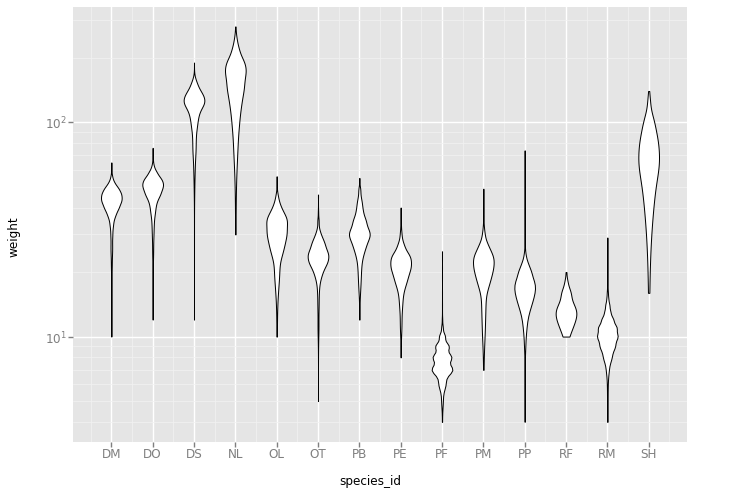

# Histograms

Often, a histogram is a better way to visualize a distribution. Plotting histograms is easy with `ggplot` using `geom_histogram()`:

~~~
ggplot(aes(x = 'weight'), data=surveys_complete) + geom_histogram(binwidth=2)
~~~
{: .python}

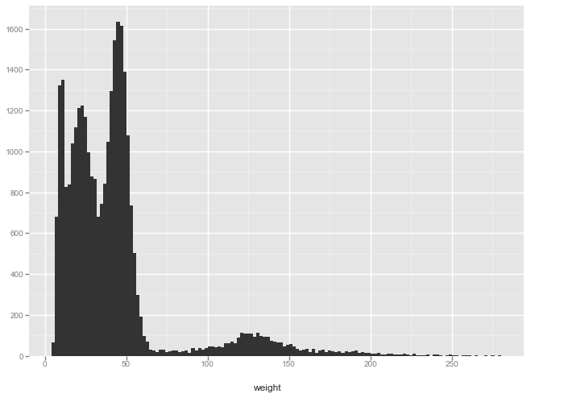

You can change the fill of the bars to be colored according to the `species_id`, to compare the weight distributions among species:

~~~
ggplot(aes(x = 'weight', fill='species_id'), data=surveys_complete) + geom_histogram(binwidth=2)
~~~
{: .python}

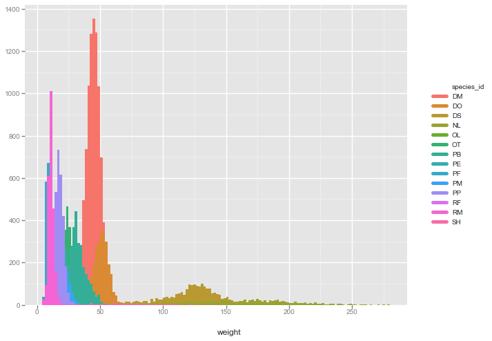

# Other Plotting Tools in Python

Ultimately, the functionality of `ggplot` in Python is not quite as rich as it is for `ggplot2` in R. This is partly because Python offers many other tools for complex visualization including `matplotlib`, [`seaborn`](https://seaborn.pydata.org/), and [`bokeh`](http://bokeh.pydata.org/en/latest/). 

For example, `seaborn` is a very nice library built on `matplotlib` that also features very nice color palettes. To install this package you need to use `conda` in your **Unix** terminal (not in Python):

```
$ conda install seaborn
```

Now, `seaborn` can be used to make very nice violin plots comparing the relative distributions of weight measurements for different sexed animals from a single species, *Onychomys leucogaster*:

~~~
import seaborn as sns
ax = sns.violinplot(x = 'sex', y = 'weight', data=surveys_complete[surveys_complete.species_id == 'OL'], palette="Set2")
~~~
{: .python}

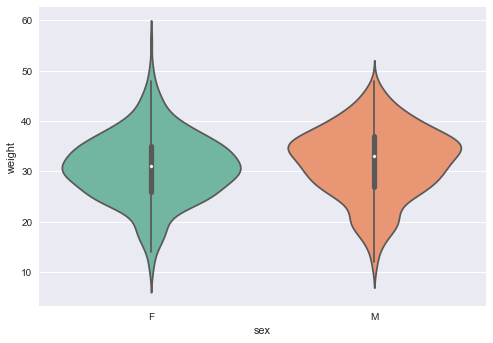

Another library called `bokeh` can create amazing, interactive graphics using D3.js (javascript). This package is also easy to install with `conda`:

```
$ conda install bokeh
```

We will use this to view histograms of the male and female weights observed for *Onychomys leucogaster*.
First, load the package and options for inline notebook output and the components for a histogram:

~~~
from bokeh.io import push_notebook, show, output_notebook
from bokeh.charts import Histogram
output_notebook()
~~~
{: .python}


~~~
hist = Histogram(surveys_complete[surveys_complete.species_id == 'OL'], values="weight", color="sex")
show(hist)
~~~
{: .python}

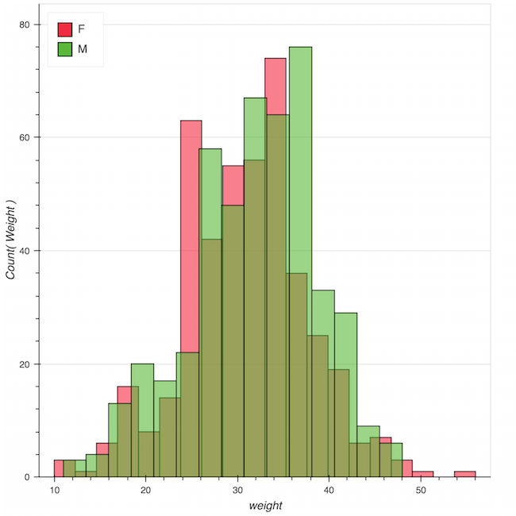

Notice the tool buttons on the side of your graph. These allow you to interact with your graphical image in an intuitive way using javascript. 


Choosing the right tool depends on what you need to do. All of these plotting libraries use different vocabularies to create graphical images, and this can make going between them difficult. 
